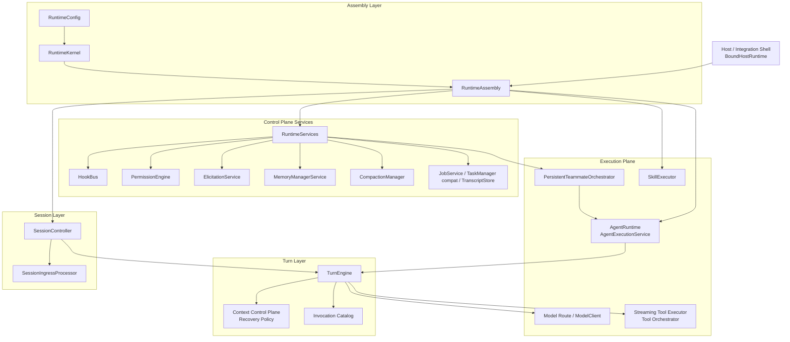
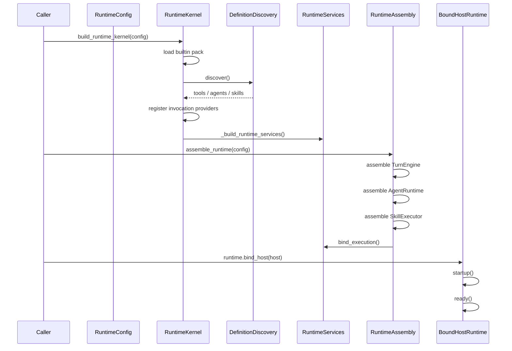
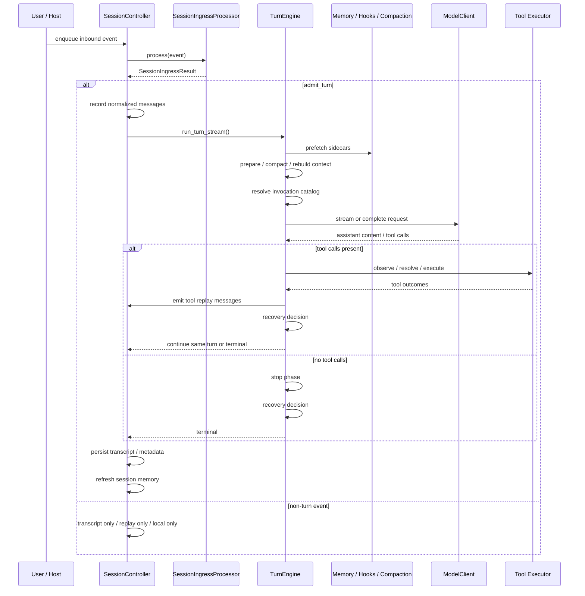
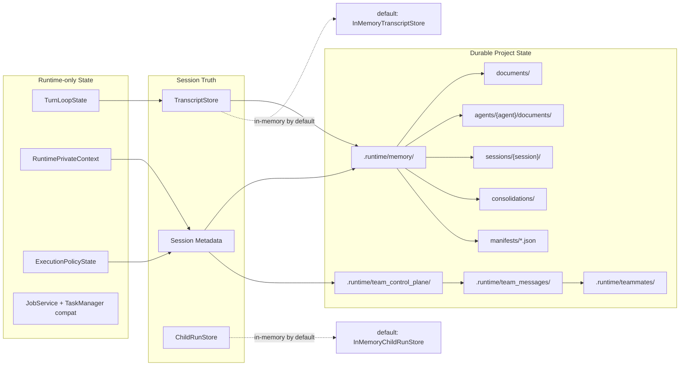
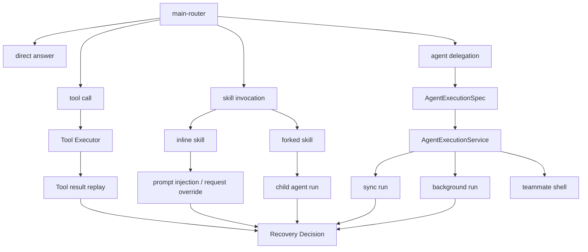

# 当前系统架构

本文档基于截至 `2026-04-21` 的仓库实现、`openspec/changes/archive/` 中的历史变更，以及 `docs/` 中已有的补充约定整理当前系统架构。当前 OpenSpec 没有 active change，因此本文描述的是系统的收敛态实现，而不是某个提案中的目标态。

## 1. 文档目的

本文档回答 5 个问题：

- 这套系统当前到底是什么。
- 它由哪些核心层次组成。
- 一次请求在系统中如何流转。
- 哪些状态会持久化，哪些只是运行时状态。
- 当前系统的扩展点和边界分别在哪里。

## 2. 系统定位

这套系统不是单一的 AI Agent 应用，而是一套可装配的 AI Agent Runtime Framework。
它当前的产品定位是 **general AI runtime framework**，而不是 Claude Code parity effort。

它的核心价值不在某个默认 agent、某组内置 tools，或者某个 memory 实现，而在于三层稳定骨架：

- 装配层：`RuntimeKernel` 和 `RuntimeAssembly`
- 会话层：`SessionController` 和 `SessionIngressProcessor`
- 单轮执行层：`TurnEngine`

围绕这三层骨架，再挂接两类横切能力：

- control plane
  - hooks
  - permissions
  - elicitation
  - memory
  - compaction
  - host bridge
  - tasks
- execution plane
  - model invocation
  - tool orchestration
  - skill execution
  - agent delegation
  - teammate orchestration

从架构风格上看，这套系统更接近一个 AI 运行时微内核，而不是围绕 prompt 组织的一层应用逻辑。

## 3. 核心架构原则

### 3.1 输入先 ingress，再决定是否执行 turn

所有 session 输入都必须先经过 `SessionIngressProcessor`。  
输入不会直接进入 `TurnEngine`，而是先被归一化成 `SessionIngressResult`，再由 session 层决定：

- 是否追加 transcript-visible message
- 是否仅向 host 回放通知
- 是否携带 private context 更新
- 是否真正 admit 一个 turn

当前 `SessionIngressResult` 至少会把结果拆成：

- `normalized_messages`
- `replay_outputs`
- `prompt_updates`
- `private_updates`

其中 `replay_outputs` 不是 transcript append 的别名，`prompt_updates` 只应出现在真正 `admit_turn` 的输入上。

这保证了 session 层对输入归一化有唯一准入面。

### 3.2 Prompt-safe context 与 runtime-private context 必须分离

这是当前系统最重要的边界。

`PromptContextEnvelope` 只承载模型可见上下文：

- memory fragments
- hook fragments
- compaction fragments
- attachments
- session hints

`RuntimePrivateContext` 只承载运行时私有控制面状态：

- permission context
- execution policy state
- run linkage
- route 和 provider 信息
- invocation mode
- diagnostics 和 private extensions

这个边界的意义是：权限、策略、调试信息和运行链路不能通过 prompt 泄露给模型，但仍然要对 tool、agent、skill 和 host 可见。

### 3.3 Transcript truth 与 active context view 分离

会话真实历史由 transcript store 和 session metadata 承担。  
某次模型调用真正看到的上下文，由 `ContextControlPlane` 在 turn 内构建。

这让系统能够同时支持：

- non-destructive context projection
- material compaction
- spillover / artifact externalization
- recovery-driven request rebuild

而不必把“模型当前看到的内容”等价成“系统历史的唯一真相”。

### 3.4 Attempt-final 与 turn-final 分离

`TurnEngine` 现在明确区分：

- attempt 结束
- turn 结束

对应到事件流上：

- `ATTEMPT_FINISHED` 表示一次模型尝试结束
- `TERMINAL` 表示整个 turn 真正结束

这个拆分是 tool continuation、stop phase、recovery policy 和 richer terminal metadata 能成立的前提。

### 3.5 生命周期 owner 必须清晰

当前系统对 ownership 的判断已经收口：

- host scope owner：`BoundHostRuntime`
- session scope owner：`SessionController`
- turn scope owner：`TurnEngine`
- tool execution owner：tool executor 和 tool orchestrator
- child execution owner：`AgentExecutionService`

这避免了 shutdown、close、interrupt 和 background cleanup 在多个层次之间交叉。

helper 语义也已经固定：

- `run_prompt()` 和 `stream_prompt()` 保证 helper-owned session close
- outer host shutdown 仍由 `BoundHostRuntime` 负责，不是 helper 的隐式职责

## 4. 分层架构视图

### 4.1 装配层

装配层负责把 runtime 的所有静态能力和运行时服务组装起来。

核心对象：

- `RuntimeConfig`
- `RuntimeKernel`
- `RuntimeAssembly`

职责分工：

- `RuntimeConfig`
  - 提供工作目录、定义源、host 绑定、model route、memory config、teammate config 等配置
- `RuntimeKernel`
  - 初始化 registries
  - 加载 builtins
  - 执行定义发现
  - 装配 invocation registry
  - 构建 runtime services
  - 绑定 host factories 与 model route 信息
- `RuntimeAssembly`
  - 组装 `TurnEngine`
  - 组装 `AgentRuntime`
  - 组装 `SkillExecutor`
  - 将 execution callbacks 回绑到 services
  - 暴露 one-shot helper 和 session 创建入口

这一层解决的是“系统怎么起”和“能力图怎么装配”，而不是“一次请求怎么跑”。

#### 4.1.1 支持的 first-party 包与分发组合

运行时现在把 first-party 代码按角色和分发组合显式建模，而不是把所有官方能力都看成同一个不可分的 kernel 包：

- 包角色
  - `runtime-core`：kernel、root boot path、core built-ins、稳定扩展契约
  - capability：`runtime-memory`、`runtime-team`
  - mechanism：`runtime-compaction`、`runtime-isolation`
  - adapter / provider：`runtime-hosts-reference`、`runtime-stores-file`、`runtime-openai`
  - profile / workflow：`runtime-devtools`、`runtime-builtin-workflows`、`runtime-planning`
- 支持的分发名
  - `runtime-core`
  - `runtime-default`
  - `runtime-full`

当前代码把 `RuntimeConfig.distribution` 作为显式选择面：

- `runtime-core`
  - 只装配 `runtime-core`
  - 保持 `main-router` + `general-purpose` 可直接启动
  - 不要求 memory、team、workspace/devtools built-ins 同时存在
- `runtime-default`
  - `runtime-core` + `runtime-memory` + `runtime-team`
  - 暴露 `remember` 与 team built-ins，但不携带 workspace/devtools 与 workflow extras
- `runtime-full`
  - 在 `runtime-default` 之上叠加 mechanism、adapter、provider、workflow、planning、devtools 包
  - 继续提供完整 first-party built-in 体验
  - `runtime-planning` 已经进入分发组合；它仍停留在 profile / workflow 层，而不是把 `task_*` / `job_*` primitive 从 `runtime-core` 搬出去

迁移旧默认 built-ins、hook 面和 first-party 包布局时，建议配合阅读 `docs/runtime-migration-notes.md`，并优先观察：

- `runtime.kernel.diagnostics`
- `runtime.services.metadata["migration"]`
- `runtime.services.metadata["first_party_package_catalog"]`

当前 builtin ownership matrix 也已经显式化：

- `runtime-core`
  - tools: `agent`、`skill`、`ask_user`、`sleep`、task/job control-plane tools
  - agents: `main-router`、`general-purpose`
- `runtime-team`
  - tools: `team_create`、`team_spawn`、`team_send`、`team_respond`、`team_delete`
- `runtime-memory`
  - skills: `remember`
- `runtime-builtin-workflows`
  - skills: `verify`、`debug`、`stuck`、`batch`、`simplify`
- `runtime-planning`
  - agents: `planner`、`coordinator`、`worker`
- `runtime-devtools`
  - tools: `read`、`glob`、`grep`、`edit`、`write`、`bash`、`web_fetch`、`web_search`
  - agents: `explore`、`plan`、`verification`

这里还需要特别区分两层语义：

- 当前真正已经随包落地的 planning helper
  - `plan`
  - 属于 `runtime-devtools`
  - 更接近只读分析 / 执行步骤拆解助手
- 当前已经由官方 package 装配的 shared-planning profiles
  - `planner`、`coordinator`、`worker`
  - 属于 `runtime-planning`
  - 它们消费的 shared planning primitive 仍应视为 `runtime-core` 所有，而不是某个上层 agent 的私有能力

#### 4.1.2 Package Protocol Integration

当前 first-party 包边界不再只靠目录位置表达，而是靠 runtime-owned protocol attachment 表达。

最小协议面现在由下面几部分组成：

- `RuntimePackageManifest`
  - 声明 package name、role、dependencies、assembly entrypoint
  - kernel 会先按 manifest dependency order 解析，再装配贡献
- `PackageContribution`
  - 统一承载 package 返回的 built-ins、capability bindings、store bindings、model provider / route bindings、job executors、lifecycle participants、host facets 与 diagnostics
- capability registry
  - package-owned runtime object 不再必须晋升为 `RuntimeServices` 顶层字段
  - shared control-plane surface 应优先通过 capability key 做发现
- host facet registry
  - optional package-owned host operation 通过 runtime-owned discovery path 暴露
  - 缺失 facet 会返回 structured `not_available` outcome，而不是依赖 ad hoc missing-method 检查
- lifecycle participants
  - runtime start
  - runtime recovery
  - session open
  - session close
  - owner 仍然是 runtime / session controller；package 只是在 owner-defined phase 内参与

当前官方包已经按这个协议收敛到 manifest-backed assembly：

- `runtime-core`
  - core built-ins 通过 manifest contribution 注册
- `runtime-memory`
  - `remember` skill 与 memory service capability 通过 contribution 暴露
- `runtime-team`
  - built-ins、control-plane objects、workflow host facet、runtime recovery participant 通过 contribution 暴露
- `runtime-openai`
  - bundled provider / route baseline 通过 contribution 装配
- `runtime-stores-file`
  - transcript / job / task-list / team 相关 store binding 通过 contribution 装配
- `runtime-compaction`、`runtime-isolation`、`runtime-hosts-reference`
  - package-owned manager / host-type surface 通过 capability binding 暴露
- `runtime-builtin-workflows`、`runtime-planning`、`runtime-devtools`
  - owned built-ins 通过 manifest-backed contribution 注册

为保持迁移平滑，`RuntimeServices` 上少量 package-specific 字段仍然存在，但它们现在应视为 compatibility projection，而不是 primary discovery contract。

### 4.2 会话层

会话层围绕 `SessionController` 展开。

它负责：

- 持有 session state
- 维护 inbound event queue
- 调用 ingress 归一化输入
- 记录 transcript
- 管理 session metadata
- 恢复 session
- 关闭 session
- 触发 session memory 刷新与 consolidation 调度

这一层已经不直接理解模型调用细节，而是把 admitted turn 委托给 `TurnEngine`。

### 4.3 单轮执行层

单轮执行层由 `TurnEngine` 承担，是系统的 canonical runtime surface。

它负责：

- 构造 turn-local execution policy
- 预取 sidecars
- 调用 context control plane
- 解析 invocation catalog
- 组装模型请求
- 驱动 stream 或 buffered completion
- 编排 tools / skills / child runs
- 执行 recovery decision
- 产出 structured turn event stream

这一层是整个 runtime 的主状态机所在。

### 4.4 Control Plane

control plane 不是单个模块，而是一组通过 `RuntimeServices` 收口的横切能力。

当前已收口的核心服务包括：

- `HookBus`
- `PermissionEngine`
- `SharedElicitationService`
- `MemoryManagerService`
- `CompactionManager`
- `HostRuntime`
- `JobService`
- `TaskManager` compatibility facade
- `TaskListService`
- `TranscriptStore`
- tool catalog refresh surface

其价值在于：这些能力不再以零散 callback 的方式分布在 session、turn、tool 或 host 层，而是有统一依赖边界。

这里还要补一条边界约束：

- `TaskManager`
  - 现在明确只是 compatibility facade，primary task contract 已转向 task-list / job services
- shared `runtime_context`
  - 仍然存在是为了兼容旧调用面
  - 新的 runtime-owned 集成应优先走 `RuntimePrivateContext`、`PromptContextEnvelope` 和 `RuntimeServices`

这里要特别区分两个名字很像、但职责已经明确分开的对象：

- `JobService`
  - 作为 runtime-owned background execution control plane
  - 持久化 generic `JobRecord`
  - 负责 executor registry、scope filtering、watch / stop 语义与 lifecycle validation
- `TaskManager`
  - 只保留为 Stage A / Stage B compatibility facade
  - 对 legacy caller 提供 `ManagedTask` 视图，但权威状态来自 `JobService`
- `TaskListService`
  - 作为 runtime-owned planning + orchestration control plane
  - 持久化共享 checklist，并负责 `claim` / `release` / `assign_next` / dependency mutation 的原子语义
  - 对外提供 derived readiness snapshot，而不是要求 host/model 自己重算可做任务

对应的 public contract 也随之固定：

- `task_*`
  - 只表示 planning task-list 语义
- `job_*`
  - 只表示 background-job query / watch / stop 语义
  - 底层统一走 canonical `JobRecord` payload，而不是 `ManagedTask` 字段

### 4.5 Execution Plane

execution plane 是直接干活的一侧，主要包括：

- 模型调用
- tool runtime
- skill runtime
- agent execution
- teammate orchestration

它们共享 `TurnEngine` 和 `RuntimeServices`，而不是各自复制一套执行框架。

## 5. 启动与装配过程

当前启动链路可以概括为：

1. 读取 `RuntimeConfig`
2. 构建 registries
3. 加载 builtins
4. 执行 definition discovery
5. 注册 invocation providers
6. 构建 `RuntimeServices`
7. 装配 `TurnEngine`、`AgentRuntime`、`SkillExecutor`
8. 按需绑定 teammate orchestrator
9. 绑定 host，形成 `BoundHostRuntime`

这里有三个重要结论：

- builtins、user definitions、project definitions 共存，但都先进入统一 registry
- invocation catalog 不是写死的，而是 provider-driven 的解析结果
- host 和 model provider 都是 runtime 的外接边界，而不是 turn engine 内部硬编码依赖

## 6. 请求流转

### 6.1 Session 入口

所有输入先进入 `SessionController`，并被转换成 `SessionCommand`。  
随后由 `SessionIngressProcessor` 生成 `SessionIngressResult`。

`IngressAdmission.kind` 当前稳定为：

- `admit_turn`
- `local_only`
- `transcript_only`
- `replay_only`
- `reject`

只有 `admit_turn` 会进入 `TurnEngine`。

### 6.2 Turn 主状态机

当前 `TurnEngine` 的稳定 phase 序列是：

1. `PREPARE`
2. `PREFETCH_SIDECARS`
3. `COMPACT_OR_REBUILD`
4. `BUILD_REQUEST`
5. `STREAM_ATTEMPT`
6. `REPLAY_TOOLS` 或 `STOP_PHASE`
7. `RECOVERY_DECISION`
8. `ADVANCE_OR_FINISH`
9. `TERMINAL`

这表明 turn 已经不是隐式 ReAct loop，而是显式状态机。

### 6.3 Request 构造

每次模型请求前，runtime 会做四件事：

1. 基于当前 agent 和父策略构造 execution policy
2. 通过 sidecars 拉取 memory、hooks、compaction 等 prompt/private 贡献
3. 通过 `ContextControlPlane` 构造 active context view
4. 通过 `ContextAssembler` 组装 prompt-safe `ModelRequest`

因此，模型请求是 runtime 统一装配的结果，而不是 session 或 tool 子系统各自补丁式拼出来的结果。

### 6.4 Tool continuation

如果模型输出了 tool calls，系统不会直接结束 turn，而是进入 tool replay 分支：

- 选择 tool executor tier
- 解析 tool calls
- 应用 permission 与 validation
- 执行 tools
- 将 tool result 回放为结构化 message
- 再进入 recovery decision，决定是否继续当前 turn

### 6.5 Recovery

recovery 现在有自己的控制面，不再散落在主循环局部分支里。

它统一处理：

- context limit
- output limit
- media / image failure
- provider overload
- auth error
- tool schema error
- interruption
- tool executor unavailable
- max turns exhausted

因此，“要不要结束”、“要不要压缩重建”、“要不要带 override 重试”已经是显式 runtime 决策，而不是调用方自己猜。

## 7. Tool、Skill、Agent 三层执行能力

### 7.1 Tool Runtime

tool runtime 现在已经是独立子系统，而不是 turn loop 中的附属逻辑。

它的稳定执行对象链路为：

- `ToolCallEnvelope`
- `ResolvedToolCall`
- `ToolOutcome`

关键能力包括：

- richer tool semantics
- permission evaluation
- input validation
- scheduler lane derivation
- concurrency safety
- failure cascade
- structured result replay
- progress / refresh / notifications

当前 tool executor 会根据 provider capabilities 自动选择：

- `FULL_STREAMING`
- `BUFFERED`
- `BATCH`
- `NONE`

这说明 tool runtime 已经是 capability-aware orchestration，而不是单一路径。

### 7.2 Skill Runtime

skill 当前不是单纯的提示词模板，而是 `prompt + metadata + runtime policy envelope`。

当前已具备的稳定语义包括：

- discovery 与 activation lifecycle
- path-scoped visibility
- user-invocable / model-invocable gate
- inline execution
- forked execution
- model / effort override
- shell expansion
- hook ownership

其中 shell expansion 的存在说明：skill 可以在 prompt 展开阶段调用运行时能力，不再只是静态文本注入。

### 7.3 Agent Runtime

agent 执行现在已经通过正式控制面收口到：

- `AgentInvocation`
- `AgentExecutionSpec`
- `AgentExecutionService`
- `AgentRunRecord`

当前支持的 child execution 形态包括：

- sync run
- background run
- forked run
- teammate-oriented shell

默认主线程 agent 为 `main-router`，其职责是：

- 直答
- 调 tool
- 调 skill
- 委派 subagent

也就是说，主线程 agent 更像“运行时控制塔”，而不是唯一干活的业务 agent。

## 8. Invocation Catalog 与上下文感知能力解析

当前可见的 skill 或 invocation 不是静态列表，而是上下文感知的解析结果。

解析时会考虑：

- `cwd`
- prompt 中提到的 path
- attachments
- workspace roots
- observed paths
- working set
- policy state
- activation override

动态 skill root 也会随着当前 session 观察到的目录变化而被纳入能力图。

这意味着 invocation visibility 已经成为 runtime 的正式语义，而不是 UI 层的过滤逻辑。

## 9. Memory Runtime

memory v2 当前已经成型为分层架构。

### 9.1 四层模型

- `LongTermMemory`
  - 共享 durable memory
  - 位于 `.runtime/memory/documents/`
- `AgentNamespaceMemory`
  - agent 私有 durable memory
  - 位于 `.runtime/memory/agents/<agent>/documents/`
- `SessionMemory`
  - 当前 session continuity artifacts
  - 位于 `.runtime/memory/sessions/<session>/`
- `ConsolidationMemory`
  - 跨 session 的慢速整合层
  - 位于 `.runtime/memory/consolidations/`

### 9.2 与 turn 的关系

memory 与 turn 的关系当前分成两半：

- pre-turn
  - retrieval
  - prompt fragment 注入
- post-turn
  - fact extraction
  - session continuity refresh
  - background extraction
  - background consolidation

### 9.3 与 compaction 的边界

当前系统已经明确区分：

- compaction 是长上下文控制机制
- session memory 是会话连续性机制

两者都可能影响下一次请求，但 authoritative owner 不同，不能混为一谈。

## 10. Host Bridge 与交互控制面

host 不是外围包装层，而是 runtime 的正式集成边界。

当前 `HostRuntime` contract 覆盖：

- startup
- ready
- shutdown
- request_permission
- request_elicitation
- current_notifications
- emit_notification
- emit_turn_event

`BoundHostRuntime` 的意义在于：

- 它是 host-scope owner
- 它统一托管 managed sessions
- 它保证 host shutdown 前先完成 session cleanup
- 它现在同时承接 runtime-owned task control plane：
  - query/watch：`list_task_lists`、`get_task_list`、`watch_task_list`
  - mutation：`create_task`、`get_task`、`update_task`、`claim_task`、`release_task`、`assign_next_task`、`block_task`、`unblock_task`、`archive_task`、`unarchive_task`、`delete_task`

这让 CLI、SDK 和未来 UI 能复用同一套 session/turn runtime，而不是各自包一个 while loop。

## 11. Teammate Orchestration

当前多 agent 协作已经拆成三层，而不是把所有语义都塞进 persistent teammate shell：

- `RuntimeTeamControlPlane`
  - durable team registry
  - leader session binding
  - persistent member records
  - leader-owned lifecycle authority
- `RuntimeTeamMessageBus`
  - structured direct / broadcast / control messages
  - leader ingress routing
  - teammate delivery routing
  - optional structured host observation
- `PersistentTeammateOrchestrator`
  - mailbox
  - stable teammate execution identity
  - permission bridge
  - task / progress projection

当前设计强调：

- execution core 继续复用 `AgentExecutionService` 和 `TurnEngine`
- team registry 与 collaboration bus 保持 runtime-owned，而不是塞回 host UI state
- teammate mailbox 仍然只负责 execution work item，不承担 leader/team lifecycle 语义
- teammate 的审批通过主控侧桥接，而不是直接接管 host 权限

这让多 agent 协作能力建立在现有 runtime 之上，而不是另起炉灶，也让 headless host 可以围绕 runtime-owned team state 做自己的 UI 或自动化。

## 12. 状态与持久化

### 12.1 持久化布局

当前仓库下，最稳定的 durable layout 是 `.runtime/memory/`。

典型结构包括：

- `.runtime/memory/MEMORY.md`
- `.runtime/memory/documents/`
- `.runtime/memory/agents/<agent>/documents/`
- `.runtime/memory/sessions/<session>/`
- `.runtime/memory/consolidations/`
- `.runtime/memory/manifests/`

如果显式配置 `FileTranscriptStore`，transcript 也会落盘。  
如果不配置，默认 transcript store 仍是 in-memory。

### 12.2 当前 authoritative owner

当前主要状态的 owner 可以总结为：

- definitions
  - registries
- session truth
  - transcript store + session metadata
- turn-local truth
  - `TurnLoopState`
- prompt-visible context
  - `PromptContextEnvelope`
- runtime-private state
  - `RuntimePrivateContext`
- runtime-owned collaboration state
  - team registry
  - leader binding
  - team message bus
- child runs
  - `ChildRunStore`
  - typed `CHILD_RUN` event 仍是 host/SDK observability truth

### 12.3 默认 task durability 边界

默认 task persistence 由 `FileTaskListStore` 提供，当前 contract 是：

- 保存时先写临时文件，再做 atomic replace
- default store 是 single-writer 设计，不声明多进程 writer safety
- archived task 继续持久化，直到显式 `task_delete` 才真正移除

因此：

- host / product 可以把 archive 当成可恢复的 retirement state，而不是 status enum 扩展
- 默认实现适合单个 runtime 进程管理自己的 task-list root
- 如果要跨进程或分布式共享 task plane，应注入自定义 `TaskListStore`
  - terminal child run 可以再经过 runtime-owned continuation bridge 进入 session ingress
- durable memory
  - `.runtime/memory/**`
- teammate shell state
  - file-backed mailbox 与 snapshots/projections

### 12.3 一个重要现实

当前默认 durable 的是 memory。  
当前默认不一定 durable 的是 transcript 和 child run history。

原因是：

- transcript 默认使用 `InMemoryTranscriptStore`
- child run 默认使用 `InMemoryChildRunStore`

这意味着当前系统更像“durable memory 优先”，而不是“全状态默认持久化”。

## 13. 扩展点

当前系统最重要的扩展面有 6 类。

### 13.1 定义扩展

通过 `DefinitionSourcePaths` 引入：

- bundled definitions
- user definitions
- project definitions

### 13.2 Host 扩展

通过 `HostBinding` 注入自定义 host runtime。

### 13.3 Model Route 扩展

通过 `ModelRouteBinding` 注入：

- provider client
- default model
- provider name
- resolved capabilities profile

### 13.4 Invocation 扩展

通过 `extra_invocation_providers` 向 invocation registry 增加额外能力源。

### 13.5 Memory Policy 扩展

通过 `RuntimeConfig.memory_config` 或 `.runtime/memory/config.yaml` 调整 memory retrieval 和 extraction 行为。

### 13.6 Team / Teammate 扩展

通过 `TeammateOrchestrationConfig` 打开 runtime-owned team control plane、team message bus 和 persistent teammate shell。

v1 的稳定 public contract 是：

- built-in tools
  - `team_create`
  - `team_spawn`
  - `team_send`
  - `team_respond`
  - `team_delete`
- addressing
  - `to="leader"` -> 当前 team leader
  - `to="*"` -> 当前 team 里除发送者之外的所有 active member
  - 其他 `to` 值 -> 当前 team 内按 teammate `name` 精确解析
- authority
  - 只有 leader 能 `team_create` / `team_spawn` / `team_delete`
  - leader 和 teammate 都能 `team_send`
  - `team_respond` 必须引用一个存在且未终态的 `workflow_id`，并且 action 必须是该 workflow 当前允许的 typed response

workflow 协议层现在也已经从 transport 层显式拆开：

- `RuntimeTeamWorkflowService`
  - 持有 durable workflow record、deadline、timeout / forced-close、responder validation 与 terminal outcome
  - `permission` 与 `shutdown` 复用同一个 request/response + stable `workflow_id` 协议形状
  - `src/runtime/team_workflows.py` 提供集中式 schema / parse / serialize helper
- `RuntimeTeamMessageBus`
  - 只负责投递 direct / broadcast / control envelope
  - workflow envelope 复用同一个 `workflow_id` 作为 correlation id，但 transport 不是 workflow authority source of truth
- ingress / ordering
  - 需要 leader 决策的 workflow request 会被合成为 runtime-generated input，附带 `workflow_id`、kind、requester、allowed actions 等 private metadata
  - 非 actionable 的 acknowledgement / terminal update 仍优先走 private 或 replay-only 路径
  - lifecycle-critical workflow，尤其 `shutdown`，在 leader ingress 上优先于普通 teammate chatter

## 14. 当前成熟度判断

从架构角度看，当前已经稳定下来的部分包括：

- `RuntimeAssembly -> SessionController -> TurnEngine` 主骨架
- control-plane spine
- session ingress protocol
- prompt/private carrier 分离
- explicit turn state machine
- streaming tool orchestration
- child-run observability
- layered memory runtime v2
- runtime-owned team control plane + message bus + teammate shell

仍应视为“契约已立、实现深度仍可继续加厚”的部分包括：

- `WORKTREE` 和 `REMOTE` isolation 目前仍偏 stub
- transcript 和 child runs 默认不是 durable store
- provider route contract 已完整，但具体 provider 仍依赖外部注入
- team mode 已经有正式 control plane / bus / tool contract，但 teammate 执行仍然复用共享 execution core

### 14.1 边界收敛 gate

当前仍保留少量 compat bridge，但收敛原则已经稳定：

- 新代码优先写 `PromptContextEnvelope` / `RuntimePrivateContext`
- 共享 `runtime_context` 只应作为 legacy 输入桥接或只读 compat snapshot
- 任何新增 shared `runtime_context` authoritative write 都应视为 rollout blocker

## 15. 历史演化主线

将 archived changes 收敛后，当前系统大致经历了 6 次架构跃迁：

1. runtime foundation
   - 建立 Python runtime skeleton
2. control-plane spine
   - 把 hooks、permissions、elicitation、memory、host 等能力收口到 `RuntimeServices`
3. boundary hardening
   - 引入 ingress、prompt/private carriers、lifecycle ownership
4. explicit main loop
   - turn state machine、recovery、context control plane 显式化
5. execution expansion
   - streaming tools、agent execution、skill semantics、route-aware provider path
6. durability and collaboration
   - layered memory v2、runtime-owned team control plane、team message bus、persistent teammate shell、test contract alignment

这条演化路径说明：当前系统重点已经从“能跑”转向“边界清晰、契约稳定、可持续扩展”。

## 16. 文档依据与限制

本文基于以下材料整理：

- `src/runtime/` 当前实现
- `docs/runtime-control-plane-extension-guide.md`
- `docs/layered-memory-runtime-v2.md`
- `openspec/specs/` 中关于 ingress、prompt/private boundary、lifecycle ownership、memory 的规格
- `openspec/changes/archive/` 中的 proposal/design/spec 轨迹

关键 conformance harness 当前集中在：

- `tests/test_session_ingress.py`
- `tests/test_session_runtime.py`
- `tests/test_query_turn_stream.py`
- `tests/test_query_runtime_protocol_golden.py`
- `tests/test_invocation_catalog.py`
- `tests/test_runtime_control_plane.py`
- `tests/test_interactive_control_plane.py`

这些测试共同锁住 ingress、prompt/private carrier、turn stream、invocation visibility 和 host/control-plane ordering 等关键契约。  
但当前 shell 的 `python3` 环境未安装 `pytest`，因此本文结论主要基于源码、历史 change 和测试分布，而不是一次实际回归执行结果。

## 17. Mermaid 图示

### 17.1 系统分层图

### 17.2 启动装配图

### 17.3 Session / Turn 时序图

### 17.4 状态与持久化边界图

### 17.5 Tool / Skill / Agent 关系图

## 18. 源码入口映射

为了方便后续继续阅读代码，下面给出当前系统的“源码地图”。

| 模块 | 主要职责 |
|---|---|
| `src/runtime/runtime_kernel/kernel.py` | runtime 装配总入口，负责 kernel、assembly、services、host binding、session helpers |
| `src/runtime/runtime_kernel/config.py` | runtime 配置模型，包括 definition sources、host bindings、model routes |
| `src/runtime/runtime_services/__init__.py` | control-plane spine，统一收口 hooks、permissions、memory、host、tasks、transcript |
| `src/runtime/session_runtime/controller.py` | session 生命周期、event queue、transcript 持久化、session memory 后处理 |
| `src/runtime/session_runtime/ingress.py` | ingress 协议与 admission 归一化 |
| `src/runtime/turn_engine/engine.py` | turn 主状态机、request 组装、model invocation、tool continuation、recovery |
| `src/runtime/turn_engine/control_plane.py` | context control plane 与 recovery 相关 contract 和实现 |
| `src/runtime/turn_engine/composer.py` | prompt-safe context 组装 |
| `src/runtime/invocation_catalog.py` | invocation visibility、path-aware skill 解析、catalog diagnostics |
| `src/runtime/tool_runtime.py` | tool context、tool scheduler、tool execution facade |
| `src/runtime/tool_executors.py` | 根据 provider capabilities 选择 tool executor tier |
| `src/runtime/tool_orchestration.py` | tool call observe / resolve / execute / replay 的生命周期编排 |
| `src/runtime/skill_runtime.py` | skill activation、inline/fork 语义、shell expansion、skill policy |
| `src/runtime/agent_runtime.py` | agent invocation facade，与 turn engine 和 skill runtime 串联 |
| `src/runtime/agent_execution_service.py` | child agent 执行控制面、route resolution、run record、isolation 准备 |
| `src/runtime/memory/manager.py` | layered memory runtime v2 的 retrieval、extraction、consolidation 主体 |
| `src/runtime/team_control_plane.py` | runtime-owned team registry、leader binding、persistent member records、runner manager |
| `src/runtime/team_message_bus.py` | structured team message envelope、durable bus、leader ingress / teammate routing、team host events |
| `src/runtime/teammate_orchestration/service.py` | persistent teammate shell、mailbox 消费、permission bridge、projection |
| `src/runtime/hosts/base.py` | host contract、callback host、bound host runtime、managed session ownership |

## 19. 推荐阅读顺序

如果要最快建立对当前系统的准确心智模型，推荐按这个顺序读代码：

1. `src/runtime/runtime_kernel/kernel.py`
2. `src/runtime/runtime_services/__init__.py`
3. `src/runtime/session_runtime/controller.py`
4. `src/runtime/session_runtime/ingress.py`
5. `src/runtime/turn_engine/engine.py`
6. `src/runtime/turn_engine/control_plane.py`
7. `src/runtime/tool_orchestration.py`
8. `src/runtime/skill_runtime.py`
9. `src/runtime/agent_execution_service.py`
10. `src/runtime/memory/manager.py`

这个顺序的原因是：先建立装配和 ownership，再进入 turn 主循环，最后再看 tool、skill、agent、memory 这些横切能力如何挂接到主骨架。
