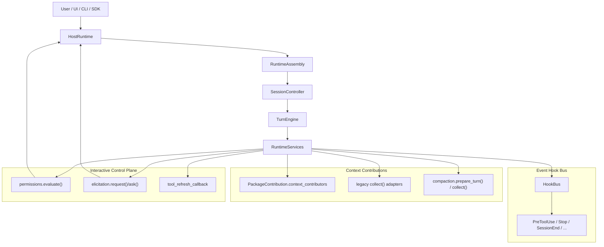

# Runtime 控制面与 Hook 接入规范

本文档面向“要把自己的逻辑挂到 Runtime 核心流转里”的接入方。  
它讨论的不是 tool / agent / skill 本体，而是 Runtime 主流程预留出来的控制面接入点，例如：

- `host`
- `permission`
- `elicitation`
- `hook bus`
- sidecar context contribution
- tool capability refresh

如果说：

- `docs/runtime-definition-authoring-guide.md`
  - 解决的是“能力怎么接进去”

那么本文解决的是：

- “我的业务逻辑怎么接进 Runtime 的执行流程里”

## 1. 先区分两类“hook”

当前 Runtime 里最容易混淆的是下面两类接口：

### 1.1 事件型 Hook

这是 `HookBus` 管理的相位型 hook。

特点：

- 事件驱动
- 有 phase
- 有 payload
- 产出 `HookEffect`

例如：

- `PreToolUse`
- `Stop`
- `SessionEnd`
- `Elicitation`

### 1.2 Sidecar / Context Contribution Hook

现在 request 构造前的 canonical 上下文接入点是
`PackageContribution.context_contributors -> RuntimeServices.context_contributor_execution_plan()`。
runtime 会按 runtime-owned stage catalog 执行这些 contributor：

- `memory`
- `hooks`
- `task_policy`

`RuntimeServices.hooks.collect()`、`RuntimeServices.memory.collect()` 和
`RuntimeServices.task_discipline.collect()` 仍可工作，但只应视为 compatibility adapter surface。
`CompactionManager` 继续走专用的 `prepare_turn() / collect()` 控制面路径，而不是被折叠进 generic contributor abstraction。

特点：

- 不是事件总线
- 更像 pre-turn sidecar
- 产出 prompt/private/diagnostics 三通道贡献

例如：

- 给 prompt 增加 hook context
- 给 private context 增加 host-private state
- 给 diagnostics 增加 sidecar trace

最简心智模型：

```text
HookBus
  -> 事件型 hook
  -> 对某个 phase 的响应

PackageContribution.context_contributors
  -> sidecar 型 context contributor
  -> 经 runtime-owned stage 执行并在 request 构造前贡献上下文
```

## 2. 控制面接入总图



## 3. Host 接入规范

### 3.1 HostRuntime 是宿主侧正式边界

当你的系统不是单纯“调一下 runtime.run_prompt()”，而是一个真正的宿主时，应实现或复用 `HostRuntime`。

正式接口包括：

- `startup()`
- `ready()`
- `shutdown()`
- `request_permission(request)`
- `request_elicitation(request)`
- `current_notifications()`
- `emit_notification(message)`
- `emit_turn_event(session_id, event)`

适合场景：

- CLI
- SDK
- Web UI / IDE shell
- 企业审批面

### 3.2 推荐接法

```python
runtime = assemble_runtime(config)
host = MyHostRuntime(...)

async with runtime.bind_host(host) as bound:
    async for event in bound.stream_prompt("Check the workspace", session_id="session-1"):
        ...
```

这一层的关键不是“换个 helper”，而是：

- Host 成为 Runtime 的正式控制面一部分
- 权限、提问、通知、turn event 都统一走 host bridge
- team mode 打开时，structured `team_event` 也通过同一条 host bridge 侧带发出，但 host 仍然不是 team state 的 authority

### 3.3 Host 生命周期顺序

当前稳定 contract 是：

1. `startup()`
2. `ready()`
3. 在 host scope 中创建 / 复用 session
4. session close 只做 session 级清理
5. host scope 结束时先关闭 managed sessions
6. 最后 `host.shutdown()`

所以：

- session close 不应顺手把宿主关掉
- 宿主 shutdown 之前，Runtime 会先做 session cleanup

### 3.4 HostLifecyclePayload 目前的定位

`HostLifecyclePayload` / `HostLifecyclePhase` 目前更像控制面模型预留位。  
当前真正稳定的 host 生命周期接入面，仍然是：

- `BoundHostRuntime`
- `HostRuntime`

不要假设 host lifecycle 已经作为 `HookBus` phase 正式派发。

### 3.5 Job Control Plane 接入点

当前 runtime 的后台执行控制已经收口到 shared job plane：

- `RuntimeServices.job_service`
- host bridge:
  - `list_jobs()`
  - `get_job()`
  - `watch_jobs()`
  - `stop_job()`
- builtin tools:
  - `job_get`
  - `job_list`
  - `job_stop`

team collaboration 的 host-facing bridge 也保持同样的最小化原则：

- 只有一个可选 structured `team_event` sink
- runtime-owned team state 查询和 mutation 不依赖 host callback
- host 不实现这个 sink 时，team routing 仍然正确，只是少了 side-channel observation

注意：

- `TaskManager` 仍然存在，但它现在是 deprecated compatibility facade
- runtime-owned constructor 应优先接 `RuntimeServices` 或 shared `JobService`；`task_manager` 只保留为 compat projection seam
- authority record 是 `JobRecord`
- host / tool surface 看到的是 canonical job payload，而不是 `ManagedTask` internals

自定义 executor 的正式注册点是：

- `RuntimeConfig.job_executors`
- `JobExecutorBinding`

最小 direct-binding 例子：

```python
from runtime import (
    JobExecutorBinding,
    JobStartResult,
    JobStatus,
    JobStopResult,
    RuntimeConfig,
    assemble_runtime,
)


class ArchiveExecutor:
    async def submit(self, request, *, context):
        return JobStartResult(
            status=JobStatus.COMPLETED,
            result={"archive_path": "artifacts/latest.txt"},
        )

    async def stop(self, record, *, context):
        return JobStopResult(status=JobStatus.STOPPED)

    async def recover(self, record, *, context):
        return None


config = RuntimeConfig.for_project(project_root)
config.job_executors["archive"] = JobExecutorBinding(executor=ArchiveExecutor())
runtime = assemble_runtime(config)
```

如果 executor 构造需要 `RuntimeServices`、`RuntimeKernel` 或 project config，应改用 factory-backed binding，而不是在 assemble 后直接 patch runtime internals。

### 3.6 Package-Owned Team / Workflow Lookup Contract

runtime-owned team / workflow path 现在应把下面这些 surface 当 canonical authority：

- capability lookup
  - `runtime.team.control_plane`
  - `runtime.team.message_bus`
  - `runtime.team.workflows`
- host facet lookup
  - `runtime.team.workflows`
- shared control-plane services
  - `RuntimeServices.job_service`
  - `RuntimeServices.task_list_service`

而已删除的 team bridge / helper 现在统一按 replacement matrix 迁移：

- `RuntimeServices.team_*` -> `RuntimeServices.resolve_team_*()`
- `RuntimeAssembly.team_*` -> `RuntimeAssembly.resolve_capability(...)`
- bound-host workflow helper -> `RuntimeHostFacetKey.TEAM_WORKFLOWS`
- `HostRuntime.emit_team_event()` -> `HostRuntime.emit_extension_event(HostExtensionEvent(namespace="runtime.team", ...))`
- `TaskManager` 仍然是 compatibility wrapper
- host facet 的 workflow list / respond 仍然必须带 `team_id` 或 `session_id` scope；缺失或不匹配的 scope 必须失败，而不是放宽成跨 team authority

team-absent 语义也需要保持明确：

- `RuntimeServices.resolve_team_*()` 在未装配 `runtime-team` 时返回 `None`
- `RuntimeAssembly.resolve_host_facet(RuntimeHostFacetKey.TEAM_WORKFLOWS.value)` 在未装配 `runtime-team` 时返回 `not_available`
- `runtime.team` namespace 的 extension event 只会在装配了 `runtime-team` 时出现

### 3.7 Package-Owned Memory / Compaction / Isolation Lookup Contract

runtime-owned primary path 现在也把下面这些 package-service protocol surface 当 canonical authority：

- service-family protocol key
  - `runtime.memory.service`
  - `runtime.compaction.manager`
  - `runtime.isolation.manager`
- shared control-plane resolver
  - `RuntimeServices.resolve_memory_service()`
  - `RuntimeServices.resolve_compaction_service()`
  - `RuntimeServices.resolve_isolation_service()`
- metadata publication
  - `runtime.services.metadata["package_lookup"]["canonical_service_family_protocols"]`
  - `runtime.services.metadata["package_lookup"]["canonical_service_family_resolvers"]`
  - `runtime.services.metadata["package_service_protocols"]`

而下面这些 surface 现在只应视为 compatibility-only projection：

- `RuntimeServices.memory`
- `RuntimeServices.compaction`
- `RuntimeServices.isolation`

如果需要区分 canonical binding 与 retained projection，不要再靠 slot 命名猜测；直接读取
`package_service_protocols` / `protocol_only_conformance` metadata。
其中 `protocol_only_conformance["gate"]["status"]` 表示 supported distribution matrix 的 terminal gate 结果，
`protocol_only_conformance["gate"]["current_assembly"]` 则保留当前 runtime 的局部 family status；`protocol_only_conformance["rule_sources"]`
标出每条 finding 由哪一个结构化 metadata source 拥有。

## 4. Permission 与 Elicitation 接入规范

### 4.1 Permission 的位置

Runtime 里的权限控制不只是 tool 层 callback，而是 control plane 的正式组成部分。

接入方式有两种：

#### 4.1.1 通过 Host

实现：

- `request_permission()`

适合：

- 需要人机审批
- 需要 UI 弹框 / CLI 确认

#### 4.1.2 通过 RuntimeServices.permissions

替换或包装：

- `PermissionEngine`

适合：

- 策略引擎
- 规则审批
- 企业权限系统

### 4.2 Elicitation 的位置

Runtime 里的“ask user”也已经是正式控制面，不应再被视为某个工具自己的特殊逻辑。

接入方式有两种：

#### 4.2.1 通过 Host

实现：

- `request_elicitation()`

#### 4.2.2 通过 RuntimeServices.elicitation

替换：

- `SharedElicitationService`

适合：

- 表单型 UI
- 多选问题
- 自动回答策略

## 5. HookBus 事件型 Hook 规范

### 5.1 当前正式 phase

当前 `RuntimeHookPhase` 包括：

- `SessionStart`
- `UserPromptSubmit`
- `PreToolUse`
- `PostToolUse`
- `PostToolUseFailure`
- `Stop`
- `SubagentStop`
- `SessionEnd`
- `Notification`
- `Elicitation`
- `ElicitationResult`
- `PreCompact`
- `PostCompact`

这些 phase 可以粗分成 4 类：

| 类别 | phase |
| --- | --- |
| session 生命周期 | `SessionStart`, `SessionEnd` |
| tool 生命周期 | `PreToolUse`, `PostToolUse`, `PostToolUseFailure` |
| turn / child 生命周期 | `Stop`, `SubagentStop` |
| 交互与通知 | `Notification`, `Elicitation`, `ElicitationResult` |

### 5.2 Hook 注册方式

#### 5.2.1 直接注册 handler

```python
runtime.services.hook_bus.register(
    session_id="session-1",
    owner="host:blocker",
    phase=RuntimeHookPhase.STOP,
    handler=lambda payload: {"continue_execution": False},
)
```

#### 5.2.2 批量注册 handlers

```python
runtime.services.hook_bus.register_handlers(
    session_id="session-1",
    owner="skill:rewrite",
    hooks={
        "PreToolUse": {
            "matcher": "echo",
            "effect": {
                "updated_input": {"value": "rewritten"},
            },
        }
    },
)
```

#### 5.2.3 通过 skill hooks 间接注册

这是当前最成熟的 definition-level hook 路径。  
skill 的 `hooks` frontmatter 在 inline / fork 语义下会进入实际注册流程。

### 5.3 Hook handler 能返回什么

handler 可以返回：

- `HookEffect`
- dict 形式的 effect
- effect 列表
- 纯字符串

最重要的 effect 字段有：

| 字段 | 含义 |
| --- | --- |
| `additional_context` | 给 prompt/hook context 追加文本 |
| `updated_input` | 改写 tool 输入 |
| `continue_execution` | 是否继续执行 |
| `notifications` | 发通知 |
| `elicitation_result` | 直接回答 elicitation |
| `stop_disposition` | 明确 stop 钩子的处置方式 |
| `injected_messages` | 注入消息 |
| `request_override` | 改写后续 request 形状 |
| `metadata` | 附加调试信息 |

### 5.4 `matcher` 的匹配规则

当前 `matcher` 可用于筛选事件目标。

支持：

- 精确值
- 通配符匹配

常见目标字段包括：

- `tool_name`
- `agent_name`
- `kind`
- `reason`
- `final_status`
- `prompt`
- `message`

因此常见写法是：

```yaml
hooks:
  PreToolUse:
    matcher: echo
    effect:
      updated_input:
        value: rewritten
```

### 5.5 Stop hook 的特殊语义

`Stop` hook 是所有 phase 里最值得谨慎使用的一个。

如果它返回：

- `continue_execution: false`

那么 Runtime 可能：

- 阻塞 session 继续
- 让 session 进入 `waiting`
- 给 terminal metadata 打上 blocked 语义

所以：

- `Stop` hook 更像流程闸门
- 不只是普通通知 hook

### 5.6 Hook 的 scope 与释放

当前 HookBus 是 session-scoped 的。

几个关键规则：

- 注册时必须带 `session_id`
- 可选 `turn_id` 实现 turn-scoped hook
- `once=True` 的 hook 触发一次后会自动释放
- inline skill hook 在 turn 结束后会被清理
- session close 时，该 session 的 hooks 会被清空

## 6. Skill hooks 与 Agent hooks 的现状

这是当前最需要在文档里写清楚的一点：

### 6.1 Skill hooks

当前已具备正式运行时语义。

- inline skill
  - 在当前 turn 注册
  - 当前 turn 结束后释放
- fork skill
  - hooks 会跟随 child execution
  - 可观测 `SubagentStop`

### 6.2 Agent hooks

当前 `AgentDefinition.hooks` 会被解析保留，但不应视为与 skill hooks 等价的成熟自动注册能力。

接入建议：

- 如果你需要稳定 hook 语义，优先用 skill hooks
- 如果你需要宿主级流程控制，优先直接注册 `HookBus`
- 不要把 file-based agent 的 `hooks` 当成当前稳定依赖

## 7. Sidecar 型上下文接入规范

### 7.1 package-contributed context contributor 不是 HookBus

这是 request 构造前的 sidecar 接口。canonical path 是
`PackageContribution.context_contributors`，由 runtime stage catalog 按
`memory -> hooks -> task_policy` 执行。

它的目标不是处理事件，而是在每轮请求前贡献上下文：

- prompt fragments
- private updates
- diagnostics

当前统一返回契约是：

- `SidecarContributionResult`

字段包括：

- `prompt_fragments`
- `private_updates`
- `diagnostics`

### 7.2 Sidecar 合并顺序

当前顺序固定为：

1. session/base context
2. ingress updates
3. staged context contributor contributions
4. request-scoped overrides

这意味着：

- package-contributed context contributor 是 request shaping 的正式一环
- 但不是唯一真相来源

### 7.3 Prompt / Private 必须分通道

sidecar 接入时必须遵守：

- prompt-facing 内容只能进 `PromptContextEnvelope`
- private execution state 只能进 `RuntimePrivateContext`
- diagnostics 只能走 private/non-prompt 通道

对于仍存在的 legacy compat path：

- `runtime_context` 只应被当作 bridge 或只读 snapshot
- 不要再通过共享 `runtime_context` mutation 写入 authoritative private state
- 这类 authoritative write 现在默认会被 runtime 阻断；只有显式 legacy mode 才会继续容忍
- 如果需要审计剩余 compat seam，直接看 `runtime.services.metadata["compatibility_boundaries"]`
- 如果需要看 closure / retirement / persistence / isolation 的总状态，直接看 `runtime.services.metadata["closure_report"]`
- 如果需要聚合 gate 结果，直接看 `runtime.services.metadata["protocol_only_conformance"]`
- 如果 embedder 需要拿同一份汇总视图，直接调用 `RuntimeAssembly.query_assembly_view()`

也就是说：

- 不能把 host-private state 直接拼到 prompt
- 不能把 diagnostics 靠 prompt 泄露给模型

### 7.4 一个 sidecar 例子

```python
from runtime.runtime_services import SidecarContributionResult


class MyHookSidecar:
    async def collect(self, **kwargs):
        return SidecarContributionResult(
            prompt_fragments=("Team convention: prefer small patches.",),
            private_updates={"host_hint": "keep-private"},
            diagnostics={"hook_diagnostics": {"matched": True}},
        )
```

挂接方式：

```python
services = RuntimeServices(hooks=MyHookSidecar())
```

## 8. Tool capability refresh 规范

某些工具执行后，能力图可能需要刷新。  
例如：

- 动态开放额外工具
- 重新装配 tool pool

当前正式接入点是：

- `tool_refresh_callback`

工具内部可触发：

```python
receipt = context.refresh_capabilities.request("tool_pool", "unlock extra tool")
```

Runtime 会在后续 request 装配时调用 refresh callback。

适合场景：

- capability unlock
- dynamic tool discovery
- 上下文变化后刷新 tool pool

## 9. 推荐给接入方的控制面分层

可以按下面这张图来选接入点：

```text
我要接 CLI / UI / SDK
  -> HostRuntime

我要接审批策略
  -> RuntimeServices.permissions
  -> 或 Host.request_permission()

我要接 ask-user / form
  -> RuntimeServices.elicitation
  -> 或 Host.request_elicitation()

我要在 phase 上拦截事件
  -> HookBus

我要在 request 构造前贡献上下文
  -> PackageContribution.context_contributors
  -> legacy `RuntimeServices.{hooks,memory,task_discipline}.collect()` 只作 compatibility adapter

我要让工具执行后刷新能力图
  -> tool_refresh_callback
```

## 10. 当前最值得强调的稳定边界

### 10.1 稳定可依赖

- `HostRuntime` / `BoundHostRuntime`
- `PermissionEngine` / host-mediated permission
- `SharedElicitationService` / host-mediated elicitation
- `HookBus` phase dispatch
- skill hooks
- sidecar prompt/private split
- `tool_refresh_callback`

### 10.2 已有模型，但当前不应过度依赖

- `AgentDefinition.hooks`
- `HostLifecyclePayload` 作为 hook event 的自动派发
- 共享 `runtime_context` 作为 authoritative private state carrier
- 用户自声明 `privileged` tool execution class

### 10.3 Compat 收敛要求

- 新扩展优先写 `PromptContextEnvelope` / `RuntimePrivateContext`
- legacy compat path 只保留单向 bridge，不再作为共享真相来源
- 新增 shared `runtime_context` write 应视为 rollout blocker

## 11. 推荐实践

```text
业务流程定制：
  优先用 Host + Permission + Elicitation

轻量流程插桩：
  优先用 HookBus

request 构造期上下文注入：
  优先用 sidecar collect()

definition-level 可复用流程：
  优先用 skill hooks，而不是 agent hooks

动态能力图：
  优先用 tool_refresh_callback，而不是临时改主循环
```

## 12. 相关文档

- `docs/runtime-integration-guide.md`
  - 总接入视角
- `docs/runtime-definition-authoring-guide.md`
  - tool / agent / skill authoring 规范
- `docs/current-system-architecture.md`
  - prompt/private carrier、ingress、lifecycle ownership 的系统总览

## 13. Stage C Cleanup Checklist

当 Stage B frozen compatibility 的退出条件全部满足后，Stage C 应至少执行下面的清理项：

- 移除 `RuntimeServices.task_manager` 作为 primary integration point 的文档定位
- 停止在 runtime-owned constructor 上把 `task_manager` 作为首选注入 seam
- 删除 runtime-owned module 对 raw `ManagedTask` widening 的继续依赖
- 把 remaining legacy embedder access 收口到显式 legacy adapter package 或 compatibility shim
- 保证 host / tool / orchestration 文档只推广 shared `JobService` 与 canonical `JobRecord` payload
- 在回归测试里保留：
  - custom executor registration
  - host job watch / stop
  - compatibility facade read / stop 行为
