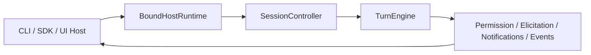
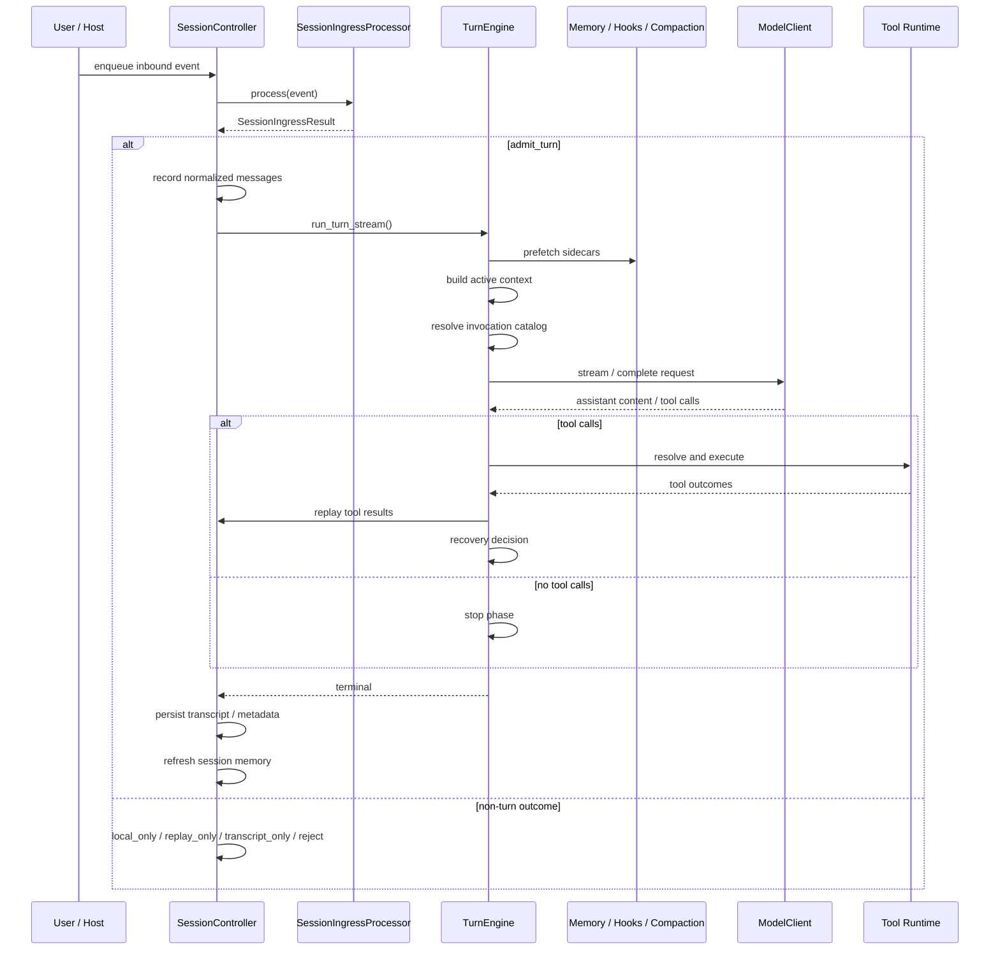

# AI Runtime 框架接入指南

本文档面向“要把这套 Runtime 接进自己系统”的使用者。  
它不重复解释全部内核细节，而是回答 4 个更实际的问题：

- 这套 Runtime 的稳定接入点在哪里。
- 不同类型的接入方分别应该从哪里接。
- 一个最小可运行集成应该长什么样。
- 接入之后，一次请求会怎样流过 Runtime。

这套框架的边界也需要先说清楚：  
Runtime 核心流转本身由框架收口，用户通常不应该改 `TurnEngine` 或在外面重写一套 orchestration。  
用户真正可扩展的部分主要有两类：

- 能力扩展
  - `tool`
  - `agent`
  - `skill`
- 控制面扩展
  - `host`
  - permission / elicitation
  - hook bus
  - sidecar context contribution
  - tool capability refresh

本文基于截至 `2026-04-21` 的仓库实现、`openspec/changes/archive/` 的演化轨迹，以及 `docs/current-system-architecture.md`、`docs/runtime-control-plane-extension-guide.md`、`docs/layered-memory-runtime-v2.md` 和对应 OpenSpec 规格中已经收敛的契约整理。

## 1. 先用一句话理解这套系统

这套系统不是一个“预置 prompt 的 Agent 应用”，而是一块可装配的 AI Runtime 主板。

你真正接入的不是 `TurnEngine` 本身，而是它外层已经稳定下来的 4 个接入面：

- `RuntimeConfig`
- `RuntimeAssembly`
- `BoundHostRuntime`
- `DefinitionSourcePaths`

可以把它想成下面这张图：

```text
                    你的系统 / 宿主
        CLI | SDK | Web API | IDE | Worker | UI Shell
                           │
                           │ run_prompt / stream_prompt / bind_host
                           ▼
┌──────────────────────────────────────────────────────────────┐
│                      RuntimeAssembly                        │
│         对外 Runtime 入口：run / stream / session          │
└───────────────┬───────────────────────────────┬─────────────┘
                │                               │
                │ create_session()              │ resolve_invocations()
                ▼                               ▼
      ┌──────────────────────┐        ┌──────────────────────┐
      │  SessionController   │        │ Invocation Catalog   │
      │ ingress / transcript │        │ visible / diagnostics│
      └──────────┬───────────┘        └──────────────────────┘
                 │
                 ▼
           ┌──────────────┐
           │  TurnEngine  │
           │  单轮状态机   │
           └──────┬───────┘
                  │
    ┌─────────────┼─────────────┬─────────────┬─────────────┐
    ▼             ▼             ▼             ▼             ▼
  Model         Tools         Skills        Agents       Memory /
  Routes       Runtime        Runtime       Runtime    Hooks / Perms
```

## 2. 这套 Runtime 当前有哪些稳定接入点

### 2.1 配置入口：`RuntimeConfig`

`RuntimeConfig` 是 Runtime 的总装配入口。  
它负责承载：

- 工作目录
- definitions 发现路径
- builtins 开关与替换
- host 绑定
- model client 与 model routes
- transcript store / child run store
- 默认 agent
- memory config
- teammate orchestration

最常见的两种构造方式：

1. 手工构造 `RuntimeConfig(...)`
2. 用 `RuntimeConfig.for_project(project_root)` 快速建立“用户级 + 项目级” definition source

其心智模型可以画成这样：

```text
┌────────────────────────────────────────────────────────────┐
│ RuntimeConfig                                              │
│                                                            │
│  [模型插槽]  model_client / model_routes                   │
│  [宿主插槽]  host_bindings / bind_host                     │
│  [能力插槽]  discovery_sources / builtins                  │
│  [记忆插槽]  memory_config                                 │
│  [协作插槽]  teammate_orchestration                        │
│  [目录插槽]  working_directory                             │
└────────────────────────────────────────────────────────────┘
```

### 2.2 Runtime 入口：`RuntimeAssembly`

`RuntimeAssembly` 是最推荐的运行时入口。  
它对接入方暴露了三类最常用能力：

- one-shot helper
  - `run_prompt()`
  - `stream_prompt()`
- session surface
  - `create_session()`
- capability discovery
  - `resolve_invocations()`
  - `visible_invocations()`
  - `invocation_diagnostics()`

如果你只是想“把这套 Runtime 嵌到自己的服务里”，绝大多数情况下就停在 `RuntimeAssembly` 即可。

### 2.3 宿主入口：`BoundHostRuntime`

当你要接入的不只是模型调用，而是一个真正的交互宿主时，应从 `runtime.bind_host(host)` 进入。

适合这类场景：

- CLI
- SDK
- WebSocket / UI shell
- 需要审批、提问、通知、turn event 的宿主

`HostRuntime` 的正式职责包括：

- `startup()`
- `ready()`
- `shutdown()`
- `request_permission()`
- `request_elicitation()`
- `current_notifications()`
- `emit_notification()`
- `emit_turn_event()`

这意味着：

- CLI、SDK、未来 UI 可以共享同一套 session / turn runtime
- 宿主不需要自己再包一层 while loop 重写 orchestration
- 审批、提问、通知和 turn event 有统一桥接面

### 2.4 能力入口：`DefinitionSourcePaths`

如果你要扩展这套 Runtime 的能力，而不是只调用它，那你接入的入口是 `DefinitionSourcePaths`。

它负责把三类用户定义接进 Runtime：

- tools
- agents
- skills

发现规则非常直接：

- `tools/*.{json,yaml,yml,py}`
- `agents/*.md`
- `skills/**/SKILL.md`

可以把这层理解为“能力投放口”，而不是“修改内核代码”。

## 3. 不同接入方，应该从哪里接

| 角色 | 首选接入点 | 主要目标 |
| --- | --- | --- |
| 业务调用方 | `RuntimeAssembly` | 直接跑 prompt / session |
| CLI / UI / SDK 宿主 | `BoundHostRuntime` | 宿主管理、审批、事件流 |
| 工具/Agent/Skill 提供方 | `DefinitionSourcePaths` | 投放和组织能力 |
| 平台层 | `RuntimeConfig` + `model_routes` + `memory_config` | 多模型、策略、可观测性 |
| Runtime 内核开发者 | `SessionController` / `TurnEngine` | 修改主循环和控制面 |

一个实用判断：

```text
业务方：从 RuntimeAssembly 进
宿主方：从 BoundHostRuntime 进
能力方：从 DefinitionSourcePaths 进
只有 Runtime 内核开发者，才应直接碰 SessionController / TurnEngine
```

## 4. 三种最常见的接入方式

### 4.1 最短路径：把它当成可嵌入 Agent Runtime

这是最短、最稳的接法。  
目标是先跑起来，再决定后面要不要接宿主桥或扩展能力。

```python
from pathlib import Path

from runtime.runtime_kernel import RuntimeConfig, assemble_runtime


async def main() -> None:
    config = RuntimeConfig.for_project(Path("/your/project"))
    config.model_client = my_model_client

    runtime = assemble_runtime(config)
    messages = await runtime.run_prompt(
        "帮我概览当前项目结构",
        session_id="demo-session",
    )
    print(messages[-1].text)
```

这条路径的特点：

- 只需要提供 `model_client`
- `for_project()` 默认接入 `~/.runtime` 和 `<project>/.runtime`
- builtins 会先加载，再叠加 user / project definitions
- `run_prompt()` 和 `stream_prompt()` 会负责 helper-owned session close

如果你的需求是“在应用里嵌一个 AI Runtime”，优先选这条路径。

### 4.2 宿主接入：把 CLI / SDK / UI 接到 Runtime 上

如果你需要审批、ask-user、turn event、通知流，就不要只停在 `run_prompt()`，而要接 `bind_host()`。

```python
from pathlib import Path

from runtime.hosts.reference import SdkHostRuntime
from runtime.runtime_kernel import RuntimeConfig, assemble_runtime


async def main() -> None:
    config = RuntimeConfig.for_project(Path("/your/project"))
    config.model_client = my_model_client

    runtime = assemble_runtime(config)
    host = SdkHostRuntime(
        name="sdk",
        ask_user_handler=lambda question, options=None: "yes",
        permission_handler=my_permission_handler,
    )

    async with runtime.bind_host(host) as bound:
        async for event in bound.stream_prompt(
            "检查当前目录里是否有风险改动",
            session_id="host-session",
        ):
            handle_turn_event(event)
```

这一类接法的核心不是“换了个调用方式”，而是把宿主本身变成 Runtime 的正式一部分：



这条路径特别适合：

- 命令行 Agent
- IDE 内嵌助手
- Web UI / TUI
- 需要人机交互审批的企业场景

### 4.3 能力接入：通过 definitions 扩展 Runtime

如果你想让 Runtime 用上自己的工具、Agent、Skill，最自然的做法不是改 Python 源码，而是投放 definitions。

项目级目录结构建议：

```text
your-project/
└── .runtime/
    ├── tools/
    │   ├── hello.py
    │   └── grep.yaml
    ├── agents/
    │   └── reviewer.md
    ├── skills/
    │   └── review/
    │       └── SKILL.md
    └── memory/
        └── config.yaml
```

其中：

- tool 是可执行能力
- agent 是角色化 prompt + policy
- skill 是 `prompt + metadata + runtime policy envelope`

一个最小的 project-level tool / agent / skill 例子可以概括成：

```text
tools/hello.py        -> 导出 TOOL_DEFINITION / TOOL / build_tool_definition()
agents/reviewer.md    -> frontmatter + prompt body
skills/review/SKILL.md -> frontmatter + content
```

接入方式也很简单：

```python
from pathlib import Path

from runtime.definitions import DefinitionSource
from runtime.runtime_kernel import DefinitionSourcePaths, RuntimeConfig, assemble_runtime

config = RuntimeConfig(
    working_directory=Path("/your/project"),
    model_client=my_model_client,
    discovery_sources=(
        DefinitionSourcePaths(DefinitionSource.PROJECT, Path("/your/project/.runtime")),
    ),
)
runtime = assemble_runtime(config)
```

## 5. 建议直接写进接入文档的目录与能力规则

### 5.1 Definition 的来源顺序

Runtime 当前会先加载 bundled pack，再叠加 discovery 出来的 user / project definitions。

可以理解为：

```text
builtins
  + user definitions
  + project definitions
  = 当前 Runtime 能力图
```

所以最短实践通常是：

1. 先用 builtins 跑通
2. 再用 project-level definitions 投放自定义能力
3. 最后才考虑禁用、替换或扩展 builtins

### 5.2 默认内置能力

当前 bundled pack 至少提供：

- 默认 agent
  - `main-router`
  - `general-purpose`
  - `explore`
  - `plan`
  - `verification`
- 默认 skill
  - `verify`
  - `debug`
  - `stuck`
  - `batch`
  - `simplify`
  - `remember`
- 默认 tool
  - `read`
  - `glob`
  - `grep`
  - `edit`
  - `write`
  - `bash`
  - `web_fetch`
  - `web_search`
  - `agent`
  - `skill`
  - `task_*`
  - `job_*`
  - `ask_user`
  - `sleep`

对大多数接入方来说，这意味着：

- 你可以先不投任何自定义 definitions，直接拿到一个可用 Runtime
- 然后逐步把自己的定义叠上去

### 5.2.1 `task_*` 与 `job_*` 的公开契约

当前 runtime 已明确把 planning 和 background execution 拆成两条 control plane：

- `task_*`
  - 面向模型规划语义
  - 由 runtime-owned `TaskListService` 提供
  - 当前 builtin surface 为 `task_create`、`task_get`、`task_update`、`task_list`
- `job_*`
  - 面向后台执行记录与停止控制
  - 继续基于内部 `TaskManager` / child run tracking
  - 当前 builtin surface 为 `job_get`、`job_list`、`job_stop`

这意味着：

- `task` 不再表示后台 job。
- `job` 不再复用规划 task 的字段。
- builtin public pack 不再把 `task_stop` 当作后台控制入口。

如果你在 host、agent 或 tool 文档里要解释这两类对象，建议直接用下面的定义：

- `task`
  - 共享 planning checklist entry
- `job`
  - runtime background execution record

### 5.2.2 Host 侧 task panel 与 job monitor

当你接的是正式宿主，而不是 one-shot helper 时，应通过 bound runtime 读取和观察这两条 surface，而不是自己拼 transcript 或通知流。

当前推荐 API：

- task list
  - `resolve_task_list_id(session_id=...)`
  - `list_task_lists(...)`
  - `get_task_list(session_id=...)`
  - `watch_task_list(session_id=..., callback=...)`
- jobs
  - `list_jobs(session_id=...)`
  - `get_job(job_id, session_id=...)`

一个实用分工：

- host task panel
  - 读 `get_task_list()` / `watch_task_list()`
  - 展示共享 plan、负责人、依赖、完成状态
- host job monitor
  - 读 `list_jobs()` / `get_job()`
  - 展示后台 agent、memory job、teammate projection 等执行状态

不要把这两类 UI 混成一个“tasks 面板”。

- planning UI 应展示 `task_*` 语义。
- operational UI 应展示 `job_*` 语义。
- 两边如果要做联动，应该靠 metadata 或显式 linkage，而不是假设 task id 等于 job id。

### 5.3 动态 skill roots

这是当前 Runtime 一个很值得在文档中强调的能力。

skill 不只来自项目根的 `.runtime/skills/`。  
当 session 已经观察到更深层目录路径时，Runtime 会把这些路径附近更深层的 `.runtime/skills/` 也纳入能力图。

例如：

```text
repo/.runtime/skills/review
repo/packages/app/.runtime/skills/review
```

当当前 session 已观察到 `packages/app/src/main.py` 时，深层 skill root 可以成为当前上下文下的有效 skill source，并优先于根目录的同名 skill。

这件事很重要，因为它说明：

- invocation visibility 已经是 Runtime 语义
- skill 可见性不是 UI 侧简单过滤
- “当前上下文看得到哪些能力”是 session-scoped 的解析结果

## 6. 一次请求在 Runtime 里是怎么流的

用户真正关心的不是所有内部对象，而是“我发一个 prompt 之后，这套 Runtime 到底做了什么”。

下面这张图就是当前最值得给接入方看的执行图：



这张图对应两个最重要的接入边界：

### 6.1 输入必须先过 ingress

所有 inbound session event 先进入 `SessionIngressProcessor`，再决定是否真正 admit 一个 turn。

换句话说：

- 输入不会直接撞到 `TurnEngine`
- ingress 才是 session 输入的唯一准入面

### 6.2 Prompt-visible 与 Runtime-private 必须分离

Runtime 当前明确区分：

- `PromptContextEnvelope`
  - 允许模型看见
- `RuntimePrivateContext`
  - 允许 tools / agents / skills / host 看见
  - 不允许直接泄露给模型

这对接入方的意义很直接：

- 权限
- policy
- route / provider 信息
- 运行链路
- diagnostics

都不应该靠 prompt 拼接传给模型。

## 7. 如果你要做可观测接入，应该看哪里

接入方经常会问两个问题：

1. 当前这轮到底有哪些能力可见？
2. 为什么某个 skill / invocation 没有出现？

当前 Runtime 已经给出了正式答案：

- 用 `resolve_invocations()` 看 session-scoped 的能力解析结果
- 用 `visible_invocations()` 看当前真正可见的能力
- 用 `invocation_diagnostics()` 看不可见或被收窄的原因

这让 IDE、UI 面板、slash palette、技能栏之类的产品能力可以建立在 Runtime 自己的能力图上，而不是自己复制一套可见性判断。

## 8. 平台层接入时，最值得保留的 4 个扩展点

### 8.1 Model Route

如果你只接一个 provider，一个 `model_client` 就够。  
如果你要做多 provider / 多模型路由，应接 `model_routes` 和 `default_model_route`。

它适合：

- 按 agent 选择不同 provider
- 不同能力走不同模型
- 在统一 Runtime 里同时承载主模型和子模型

一个更完整的 v1 例子现在可以直接把 context window ownership 放在 route / provider 层，而不是 agent 自己维护：

```python
from runtime import (
    ModelContextWindowProfile,
    ModelProviderBinding,
    ModelRouteBinding,
    RouteContextWindowPolicy,
    RuntimeConfig,
    TokenEstimationHint,
)

config = RuntimeConfig.for_project(project_root)

config.model_providers["research-openai"] = ModelProviderBinding(
    client=my_openai_client,
    provider_name="openai-prod",
    context_window_profiles=(
        ModelContextWindowProfile(
            provider_name="openai-prod",
            model_selector="gpt-4.1-mini",
            max_input_tokens=128000,
            reserved_output_tokens=8192,
            token_estimation_hint=TokenEstimationHint(chars_per_token=4.0),
        ),
    ),
)

config.model_routes["research"] = ModelRouteBinding(
    provider_binding="research-openai",
    default_model="gpt-4.1-mini",
    context_window_policy=RouteContextWindowPolicy(
        trigger_buffer_tokens=4096,
        reserved_output_tokens_override=12000,
        policy_tag="research-safe-headroom",
    ),
)

config.default_model_route = "research"
```

这个模式下：

- agent 继续只声明 `model_route`
- provider / integration 负责注册 exact / pattern / provider-default 的 context window profile
- route 只做 narrowing / override / fallback policy
- runtime 在已知 context window 时做 proactive compaction，在未知 context window 时退化到 reactive-only

另外，Runtime 现在随附一个可发现但可覆盖的 bundled OpenAI baseline：

- provider binding: `openai-prod`
- named route: `openai_default`
- host override env: `OPENAI_API_KEY`、`OPENAI_BASE_URL`、`OPENAI_MODEL`

如果宿主没有提供 `OPENAI_API_KEY`，内置 route 不会从 discovery 里消失，但首次调用会返回结构化的配置/凭证错误。

### 8.2 Memory Policy

如果你要调记忆召回和抽取，不需要改内核。  
当前可通过两种方式声明式接入：

- `RuntimeConfig.memory_config`
- `.runtime/memory/config.yaml`

这层适合：

- 调 retrieval 数量和偏好
- 调 extraction 的 safe routing
- 调 session memory refresh 阈值
- 调 consolidation cadence

### 8.3 Extra Invocation Providers

如果你的产品不只想暴露 skill，还想纳入 slash command、plugin command、MCP prompt 之类的能力源，应接 `extra_invocation_providers`。

这让更多能力源可以进入统一 invocation catalog，而不是让 host 再自己造一套能力列表。

### 8.4 Persistent Teammate Shell

如果你要做多 agent 协作，不要直接把它理解成“再起一个执行引擎”。  
当前更合适的接入点是 `teammate_orchestration`。

它提供的是：

- mailbox
- stable identity
- permission bridge
- task / progress projection

而不是第二套 query engine。

## 9. 接入方最容易踩错的地方

### 9.1 不要把 `TurnEngine` 当成普通 SDK 入口

`TurnEngine` 是执行核心，不是普通业务调用方的最佳入口。  
普通接入方优先用：

- `assemble_runtime()`
- `RuntimeAssembly`
- `BoundHostRuntime`

### 9.2 不要在 Runtime 外再复制一套 session / host loop

如果你需要交互宿主，优先走 `bind_host()`。  
否则你很容易在外面重新发明：

- 审批流
- ask_user
- turn event stream
- lifecycle ordering

而这些都已经是 Runtime 的正式契约。

### 9.3 不要假设 transcript 和 child runs 默认持久化

当前默认 durable 的重点是 memory。  
默认不一定 durable 的包括：

- transcript
- child run history

如果你的产品需要强持久化，要显式接 transcript store / child run store。

### 9.4 不要继续把共享 `runtime_context` 当 authoritative state

新的正式方向是：

- prompt-visible 走 `PromptContextEnvelope`
- runtime-private 走 `RuntimePrivateContext`

`runtime_context` 当前更多是 compat bridge，而不是建议新增依赖的正式扩展面。
如果必须兼容 legacy caller 或 sidecar，也应把它当作单向 bridge 或只读 snapshot，而不是新的 authoritative private state carrier。

## 10. 一张接入路线图

如果你只想知道“我应该怎么开始”，可以直接用这张图：

```text
目标 A：先跑起来
  -> RuntimeConfig.for_project()
  -> config.model_client = ...
  -> assemble_runtime(config)
  -> runtime.run_prompt() / runtime.stream_prompt()

目标 B：我要长会话
  -> assemble_runtime(config)
  -> runtime.create_session()
  -> session.start() / enqueue_event() / stream_until_idle()

目标 C：我要 CLI / UI / SDK 宿主
  -> assemble_runtime(config)
  -> runtime.bind_host(host)
  -> bound.run_prompt() / bound.stream_prompt()

目标 D：我要自定义能力
  -> .runtime/tools|agents|skills
  -> DefinitionSourcePaths(...)
  -> resolve_invocations() / visible_invocations()

目标 E：我要多 provider / 多模型
  -> model_routes + default_model_route

目标 F：我要可调记忆策略
  -> memory_config 或 .runtime/memory/config.yaml
```

## 11. 推荐在产品文档里直接引用的结论

可以直接把下面这段话当成这套 Runtime 的产品化描述：

> 这套 AI Runtime 的推荐接入方式不是直接操作底层 turn loop，而是通过 `RuntimeConfig` 装配模型、definitions、memory 和 host，再通过 `RuntimeAssembly` 或 `BoundHostRuntime` 运行请求。  
> Runtime 已经把 session ingress、turn state machine、tool / skill / agent 执行、权限与提问控制面、memory、invocation visibility 和 host bridge 收敛成一套统一契约。  
> 因此，接入方通常只需要选择自己属于“业务调用方、宿主开发者、能力扩展方、平台层”中的哪一类，再接对应的入口即可。

## 12. 相关文档

- `docs/runtime-definition-authoring-guide.md`
  - 讲用户如何新增 `tool` / `agent` / `skill`
- `docs/runtime-control-plane-extension-guide.md`
  - 讲 host、permission、elicitation、hook、sidecar 等控制面接入
- `docs/current-system-architecture.md`
  - 讲“系统是什么”
- `docs/layered-memory-runtime-v2.md`
  - 讲 memory v2 的分层模型和配置面
