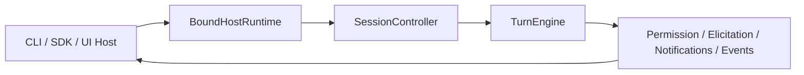
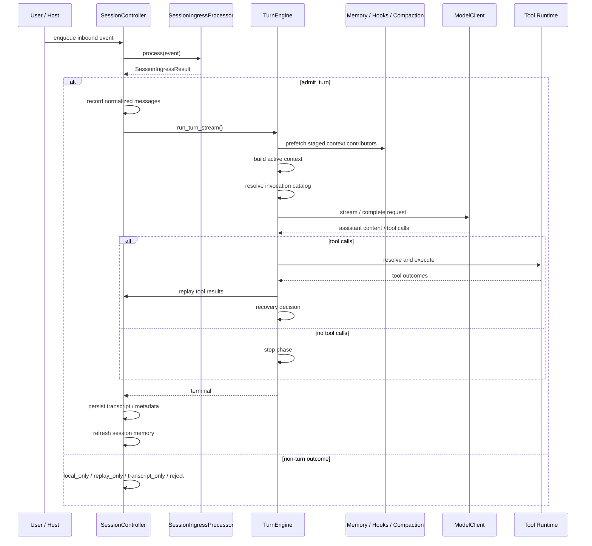

# AI Runtime 框架接入指南

本文档面向“要把这套 Runtime 接进自己系统”的使用者。  
它不重复解释全部内核细节，而是回答 4 个更实际的问题：

- 这套 Runtime 的稳定接入点在哪里。
- 不同类型的接入方分别应该从哪里接。
- 一个最小可运行集成应该长什么样。
- 接入之后，一次请求会怎样流过 Runtime。

这套框架的边界也需要先说清楚：它现在的定位是 **general AI runtime framework**，而不是 Claude Code parity effort。  
Runtime 核心流转本身由框架收口，用户通常不应该改 `TurnEngine` 或在外面重写一套 orchestration。  
用户真正可扩展的部分主要有两类：

- 能力扩展
  - `tool`
  - `agent`
  - `skill`
- 控制面扩展
  - `host`
  - permission / elicitation
  - hook bus
  - package-contributed context contributors
  - tool capability refresh

本文基于截至 `2026-04-27` 的仓库实现、`openspec/changes/archive/` 的演化轨迹，以及 `docs/current-system-architecture.md`、`docs/weavert-control-plane-extension-guide.md`、`docs/layered-memory-weavert-v2.md` 和对应 OpenSpec 规格中已经收敛的契约整理。

如果你要新建一个自己的项目，先从 `docs/weavert-starter-scaffolds.md` 里的官方 starter scaffold 开始。  
如果你想跑仓库自带的 validation path，再看 `demos/README.md`。  
demo suite 负责验证端到端工作流；starter scaffold 才是普通接入方的推荐起点。  
本文继续保留为装配语义、接入边界和运行时流转的规范说明。

## 0. Start here: official starter scaffolds

从 `2026-05-04` 起，仓库提供了一组官方 starter scaffold，专门覆盖最常见的 adoption entry path：

- `minimal-project`
- `headless-workflow`
- `live-smoke`

这些 scaffold 的约束是：

- 使用 canonical `weavert` public imports
- 使用 canonical `.weavert/` workspace layout
- 使用匹配的官方 assembly preset
- 不把 demo-private helper 当作 primary user-facing path

官方生成入口统一为 `weavert-starter generate ...`。  
形状、命令和使用建议见 `docs/weavert-starter-scaffolds.md`。

## 1. 先用一句话理解这套系统

这套系统不是一个“预置 prompt 的 Agent 应用”，而是一块可装配的 AI Runtime 主板。

你真正接入的不是 `TurnEngine` 本身，而是它外层已经稳定下来的 4 个接入面：

- `RuntimeConfig`
- `RuntimeAssembly`
- `BoundHostRuntime`
- `DefinitionSourcePaths`

可以把它想成下面这张图：

```text
                    你的系统 / 宿主
        CLI | SDK | Web API | IDE | Worker | UI Shell
                           │
                           │ run_prompt / stream_prompt / bind_host
                           ▼
┌──────────────────────────────────────────────────────────────┐
│                      RuntimeAssembly                        │
│         对外 Runtime 入口：run / stream / session          │
└───────────────┬───────────────────────────────┬─────────────┘
                │                               │
                │ create_session()              │ resolve_invocations()
                ▼                               ▼
      ┌──────────────────────┐        ┌──────────────────────┐
      │  SessionController   │        │ Invocation Catalog   │
      │ ingress / transcript │        │ visible / diagnostics│
      └──────────┬───────────┘        └──────────────────────┘
                 │
                 ▼
           ┌──────────────┐
           │  TurnEngine  │
           │  单轮状态机   │
           └──────┬───────┘
                  │
    ┌─────────────┼─────────────┬─────────────┬─────────────┐
    ▼             ▼             ▼             ▼             ▼
  Model         Tools         Skills        Agents       Memory /
  Routes       Runtime        Runtime       Runtime    Hooks / Perms
```

## 2. 这套 Runtime 当前有哪些稳定接入点

### 2.1 配置入口：`RuntimeConfig`

`RuntimeConfig` 是 Runtime 的总装配入口。  
它负责承载：

- `distribution`
- 工作目录
- definitions 发现路径
- builtins 开关与替换
- host 绑定
- model client 与 model routes
- transcript store / child run store
- 默认 agent
- memory config
- teammate orchestration

最常见的两种构造方式：

1. 手工构造 `RuntimeConfig(...)`
2. 用 `RuntimeConfig.for_ordinary_workflow(project_root)` 快速建立“用户级 + 项目级” definition source（旧的 `for_project()` 仍可作为 alias 使用）

其心智模型可以画成这样：

```text
┌────────────────────────────────────────────────────────────┐
│ RuntimeConfig                                              │
│                                                            │
│  [分发插槽]  distribution: core / default / full           │
│  [模型插槽]  model_client / model_routes                   │
│  [宿主插槽]  host_bindings / bind_host                     │
│  [能力插槽]  discovery_sources / builtins                  │
│  [记忆插槽]  memory_config                                 │
│  [协作插槽]  teammate_orchestration                        │
│  [目录插槽]  working_directory                             │
└────────────────────────────────────────────────────────────┘
```

关于分发语义，当前应这样理解：

- `weavert-core`
  - 只保证 kernel、`main-router` root boot path、core built-ins 和稳定扩展契约
- `weavert-default`
  - 在 `weavert-core` 上叠加 first-party memory 与 team capability 包
- `weavert-full`
  - 在 `weavert-default` 上叠加 devtools、workflow、planning、provider、adapter、mechanism 包
  - `weavert-planning` 已经作为独立 profile / workflow 包落地，并默认包含在 `weavert-full` 中

如果你是从旧默认 built-ins 或旧 hook 面迁移过来，建议同时阅读 `docs/weavert-migration-notes.md`。  
特别是 `read`、`glob`、`grep`、`edit`、`write`、`bash`、`web_fetch`、`web_search`、`explore`、`plan`、`verification` 现在都属于 `weavert-devtools`，默认只在 `weavert-full` 中自动启用。

如果你的集成会直接使用 bundled `openai_default` route，还需要知道一个较新的兼容性细节：

- 当某些 OpenAI-compatible gateway 在 streaming 过程中已经正确 finalize 出 tool calls，但最终 `response.completed.output` 却返回空数组时，bundled adapter 会在 adapter 边界内做一次窄范围修正
- 修正结果只会把该次 streaming turn 的 terminal stop reason 保持为 `tool_use`，并继续复用已经观测到的 streamed `ToolUseBlock`
- healthy OpenAI Responses payload、buffered completion 和 runtime 自己的 canonical transcript/tool contract 都不会因为这个 fallback 改变

这里有一个容易混淆但必须先分清的边界：

- `plan`
  - 当前真实存在的 bundled agent
  - 属于 `weavert-devtools`
  - 更接近 read-only planning helper
- `planner` / `coordinator` / `worker`
  - 当前文档已经在用的角色化 profile 词汇
  - 已经由 `weavert-planning` 作为官方 built-ins 装配，默认随 `weavert-full` 提供

普通接入方默认应该围绕这些稳定边界扩展：

- `tool`
- `agent`
- `skill`
- `host`
- stable public hooks

而不是把 `TurnEngine`、shared `runtime_context` 或 `TaskManager` compatibility facade 当作 primary extension story。

如果你要把一个 embedder-owned runtime package 显式接进当前实例，现在 canonical config slot 是
`RuntimeConfig.extra_package_manifests`：

- 接受 `RuntimePackageManifest` 实例，或可解析为 manifest 的本地 entrypoint string
- runtime 会先校验 manifest shape、trust boundary 与官方 first-party reserved name；通过校验的 external manifest 会先进入 local package candidate catalog
- 当前不支持 override mode，也不会自动扫描目录、remote discovery、package install 或 Python environment dependency management
- 被拒绝的 external manifest 不会进入 candidate catalog；未被选择进 resolved graph 的 admitted external candidate 也不会进入 built-ins / services / runtime contribution
- 诊断与 provenance 会单独发布到 `weavert.services.metadata["package_registration"]` 和 `weavert.metadata["package_registration"]`

如果你要让某个 admitted external package 真正进入当前 runtime，还需要通过
`RuntimeConfig.requested_packages` 按 package name 显式请求它：

- 这个输入只负责 external package name request；first-party package 仍通过 distribution defaults 与 `enabled_packages` / `disabled_packages` 控制
- runtime 会在 package assembly 之前把 selected first-party manifests、admitted external candidates 与 explicit package requests 一起做 deterministic resolution
- missing package、conflicting constraint、incompatible candidate、cyclic dependency 都会以 machine-readable diagnostics 形式体现在 `package_resolution` metadata 里，并在 resolution 失败时阻断 assembly
- 官方 first-party package catalog 本身现在也走 manifest-backed provider：selected slice 继续发布到 `first_party_package_catalog`，完整 catalog ownership / distribution defaults / assembly provenance 则单独发布到 `official_package_catalog_provenance`

如果你在做 coding / chat / local-assistant 这种 product profile，推荐再多分一层心智模型：

- distribution
  - 负责 coarse-grained first-party baseline
- scenario pack
  - 仍然是 ordinary external runtime package
  - 通过 `extra_package_manifests` + `requested_packages` 接入
  - 可以依赖 shared package，并推荐 `enabled_packages` / `disabled_packages`
- app-owned wiring
  - 继续负责 provider route、store、host binding、以及 final permission-policy composition

也就是说，scenario pack 不是新的 profile-selection API，更不是 host / permission owner。
它只是把 product-profile guidance 放回现有 package-selection surfaces 上。具体 reference
shape 见 `docs/weavert-scenario-runtime-pack-architecture.md`。
其中 capability metadata 里列出的 expected agents / skills，也依赖你把推荐 first-party
packages 一并启用；单独 request scenario pack 不会自动把这些 surface 注册进 runtime。

### 2.2 Runtime 入口：`RuntimeAssembly`

`RuntimeAssembly` 是最推荐的运行时入口。  
它对接入方暴露了几类最常用能力：

- one-shot helper
  - `run_prompt()`
  - `run_prompt_report()`
- streaming helper
  - `stream_prompt()`
  - `stream_prompt_report()`
- session surface
  - `create_session()`
  - `run_prompt_report_in_session()`
  - `stream_prompt_report_in_session()`
- capability discovery
  - `resolve_invocations()`
- assembly query surface
  - `query_assembly_view()`
  - `query_assembly_posture(session)`
  - `visible_invocations()`
  - `invocation_diagnostics()`

如果你只是想“把这套 Runtime 嵌到自己的服务里”，绝大多数情况下就停在 `RuntimeAssembly` 即可。

#### 2.2.1 结果投影 helper：优先问 runtime 常见问题，不要自己刮 transcript

从 `2026-05-04` 起，runtime 提供了一层公开的 result-projection helper，用来回答 headless workflow validation 和 post-run inspection 最常见的问题，而不是让每个 caller 再自己遍历 `RuntimeMessage.content`：

- `latest_tool_outcome(...)`
- `latest_skill_outcome(...)`
- `final_assistant_text(...)`
- `terminal_failure(...)`
- `child_summary(...)`

这些 helper 同时支持两类输入：

- raw `tuple[RuntimeMessage, ...]`
- higher-level report object，例如 `WorkflowRunReport`

如果你只有 raw messages，也可以按需补充 terminal 或 child-run context；如果你已经有 report object，直接把 report 传进去即可。

```python
from weavert import (
    child_summary,
    final_assistant_text,
    latest_skill_outcome,
    latest_tool_outcome,
    terminal_failure,
)

report = await runtime.run_prompt_report(
    "Review the workspace and summarize the result.",
    agent_name="coding-assistant",
    cwd=workspace,
)

verification = latest_tool_outcome(
    report,
    "bash",
    matcher=lambda outcome: str(
        outcome.tool_input.get("command")
        or (
            outcome.output.get("command")
            if isinstance(outcome.output, dict)
            else ""
        )
        or ""
    ).strip()
    == "python3 -m unittest discover -s tests",
)
review = latest_skill_outcome(report, skill_name="review-change")
failure = terminal_failure(report)
summary_text = final_assistant_text(report)
reviewer = child_summary(report, agent_name="reviewer")
scope_tools = reviewer.scope_summary.visible_tools if reviewer and reviewer.scope_summary else ()
scope_memory = reviewer.scope_summary.memory_scope if reviewer and reviewer.scope_summary else None
```

推荐这样理解这层 surface：

- 它回答“最后一次 bash 验证结果是什么”“最终 assistant summary 是什么”“最近一次 review skill 结果是什么”这类通用问题
- 它保留 typed projection，而不是只返回松散 dict
- `child_summary(...)` 优先走 parent-visible child result contract；只有在 caller 显式提供 child run records / child projections 时，才回退到 richer child-run observability surface
- `child_summary(...).scope_summary` 当前会把 delegated child 的 `visible_tools`、`visible_skills`、`permission_mode`、`memory_scope`、`isolation_mode` 一并保留下来
- 如果你是 typed SDK、UI schema 或 contract test 这类 schema-driven consumer，built-in `agent` tool 的 `output_schema` 现在也正式声明了同一份最小 `scope_summary` 结果契约，不需要再从 demo 或 payload 偶然性里反推
- 这意味着 parent 侧 workflow validation 通常不需要再检查 raw child transcript
- 如果你只是想回答“这个 child 最终到底还能调用哪些工具 / skill，以及权限、memory、隔离 posture 是什么”，优先看 `scope_summary`，不要回去翻 request-time metadata
- 如果你还要审计 child 的 memory reach 或完整 execution policy，当前 `scope_summary` 还不是 full policy dump；继续看 child-run observability 或 request-time policy metadata

如果你发现自己在业务代码、demo、test 或 host layer 里手写下面这些模式，优先考虑改用 projection helper：

- 倒序扫描 assistant message 找最终 summary
- 自己维护 `tool_use_id -> ToolUseBlock` map 只为了找最后一次工具结果
- 从 skill tool result 里手工拆最新 skill outcome
- 为了拿 child summary 再去读 child transcript

raw transcript 和 child-run history 仍然是正式底层契约；projection helper 只是把常见问法收敛成稳定、可复用的上层读接口。

#### 2.2.2 Workflow testing kit：优先用 `weavert.testing` 走 deterministic offline validation

从 `2026-05-04` 起，runtime 还提供了一个正式的 `weavert.testing` namespace，把之前散落在 demo-private helper 里的离线 workflow 验证路径产品化成了公共 surface：

- scripted model helper：`ScriptedModelClient`
- fixture workspace helper：`copied_fixture_workspace(...)`、`temporary_workspace(...)`
- project discovery helper：`discovery_source(...)`
- headless workflow harness：`run_workflow_test(...)`
- common assertions：`assert_tool_outcome(...)`、`assert_skill_outcome(...)`、`assert_child_summary(...)`

推荐用法是：让 fixture helper 复制一个可写 workspace，再把 scripted model 和 public harness 接到同一个 ordinary-workflow path 上。

```python
import asyncio
from pathlib import Path

from weavert.testing import (
    ScriptedModelClient,
    assert_tool_outcome,
    copied_fixture_workspace,
    run_workflow_test,
    text_batch,
    tool_call_batch,
)

FIXTURE_ROOT = Path("demos/projects/workspaces/coding_workflow")

client = ScriptedModelClient(
    [
        tool_call_batch(
            request_id="req-1",
            tool_name="skill",
            tool_input={"skill": "coding-loop"},
            call_id="call-coding-loop",
        ),
        text_batch(request_id="req-2", text="done"),
    ]
)

async def main() -> None:
    with copied_fixture_workspace(FIXTURE_ROOT) as fixture:
        report = await run_workflow_test(
            "Apply the coding-loop skill and finish with a short summary.",
            workspace=fixture,
            model_client=client,
            session_id="coding-workflow-test",
            agent_name="coding-assistant",
        )

        assert report.fixture_source == FIXTURE_ROOT.resolve()
        assert report.workspace_root != FIXTURE_ROOT.resolve()
        assert_tool_outcome(report, "skill")

asyncio.run(main())
```

这层 surface 的目标不是替代 `pytest`，而是把 runtime 自己最常见的 workflow-level test glue 收敛成正式 API：

- 不再要求用户复制 `demos/_shared/*`
- 不再要求用户自己拼 temporary workspace + `.weavert/` discovery
- 不再要求用户自己写 `assemble_runtime(...) + run_prompt_report(...) + transcript scraping` glue
- harness 返回的 `WorkflowTestReport` 直接包裹 canonical `WorkflowRunReport`，所以 shared lifecycle 语义不会和普通 headless run 漂移

如果你只想做 deterministic offline validation，优先从这套 testing namespace 开始；只有在你需要 host binding、interactive approval、或更复杂的 runtime assembly 介入时，再往更低层的 `RuntimeAssembly` surface 走。

### 2.3 宿主入口：`BoundHostRuntime`

当你要接入的不只是模型调用，而是一个真正的交互宿主时，应从 `weavert.bind_host(host)` 进入。

适合这类场景：

- CLI
- SDK
- WebSocket / UI shell
- 需要审批、提问、通知、turn event 的宿主

`HostRuntime` 的正式职责包括：

- `startup()`
- `ready()`
- `shutdown()`
- `request_permission()`
- `request_elicitation()`
- `current_notifications()`
- `emit_notification()`
- `emit_turn_event()`

### 2.4 Package Boundary = Protocol Attachment

现在判断一个 first-party 或 embedder-owned package 是否“接上了 runtime”，不应只看它放在哪个目录里，而应看它是否通过 protocol attachment 接入：

- 是否发布 `RuntimePackageManifest`
- 是否声明 dependency ordering
- 是否通过 `PackageContribution` 返回 owned surfaces
- 是否把 package-owned object 暴露到 capability registry
- 是否把 optional host operation 暴露到 host facet registry

接入方应优先沿下面的顺序扩展：

1. tool / agent / skill definition
2. stable public hooks
3. package contribution
4. capability lookup
5. host facet discovery

而不应再把这些旧路径当成 primary extension story：

- patch kernel-owned first-party assembler tables
- patch kernel-owned optional built-in loader tables
- 给 `RuntimeServices` 继续增加 package-specific 顶层字段
- 给 mandatory `HostRuntime` contract 继续增加 optional package helper

当前官方包已经按这一思路装配：

- built-ins 由 package contribution 注册
- OpenAI provider / route baseline 由 `weavert-openai` contribution 注册
- file-backed core stores 由 `weavert-stores-file` contribution 注册
- team control-plane object 与 workflow host facet 由 `weavert-team` contribution 注册

如果你要接的是本地 external package，也应走同一条 manifest + contribution path，只是注册入口变成
`RuntimeConfig.extra_package_manifests`，而不是修改 `FIRST_PARTY_PACKAGE_SPECS`、
`official_runtime_package_manifests()` 或其他 kernel-owned 表。

如果你在做自定义 integration，推荐把“包边界”理解成：

- 不是“某段代码从 `weavert-core/` 挪到别的目录”
- 而是“这段能力能否通过 manifest + contribution + lookup contract 独立接入”
- capability lookup / host-facet lookup / lifecycle participant 才是 package-owned runtime behavior 的 canonical path
- ingress `completion_receipts` 现在也是 package-owned post-ingress ack 的 canonical attachment path
- runtime-owned team path 现在只走 capability lookup、host facet、lifecycle participant 与 generic extension event contract
- 已删除的 `RuntimeServices.team_*`、`RuntimeAssembly.team_*`、bound-host workflow helper 与旧 host bridge 都通过 `weavert.services.metadata["migration"]["team_protocol_only"]["replacement_matrix"]` 发布 replacement matrix

当前 runtime metadata 也会显式标这些边界：

- `weavert.services.metadata["core_protocol_catalog"]`：stable core protocol catalog，包含 schema version、owner、binding boundary、canonical binding surface、discovery surface 与 compatibility status
- `weavert.services.metadata["official_package_catalog_provenance"]`：manifest-backed 官方 first-party package catalog、distribution defaults、assembly entrypoint provenance 与退役 kernel helper
- `weavert.services.metadata["resolved_active_package_graph_provenance"]`：当前 runtime active graph 的 resolved order、source provenance 与 assembly entrypoint
- `weavert.services.metadata["package_registration"]`：external package accepted / rejected registration、diagnostics、provenance、trust-boundary details
- `weavert.services.metadata["package_resolution"]`：raw candidate catalog、resolution request inputs、resolved graph 与 structured diagnostics
- `weavert.services.metadata["package_manifests"]`：真正进入装配的 resolved manifest inventory
- `weavert.services.metadata["package_lookup"]`：canonical capability / host-facet / lifecycle / receipt path
- `weavert.services.metadata["invocation_provider_paths"]`：built-in baseline、package canonical path、package contribution ordering
- `weavert.services.metadata["invocation_provider_registrations"]`：当前 runtime 里实际生效的 provider 注册顺序、owner、origin 与 registration metadata
- `weavert.services.metadata["protocol_only_conformance"]`：聚合后的 protocol-only finding、shared finding schema、rule-source mapping 与 terminal gate status
- `weavert.metadata["core_protocol_catalog"]`：`RuntimeAssembly` 侧同步暴露的 stable core protocol catalog
- `weavert.metadata["official_package_catalog_provenance"]` / `weavert.metadata["resolved_active_package_graph_provenance"]`：`RuntimeAssembly` 侧同步暴露的官方 catalog ownership 与 resolved active graph provenance
- `weavert.metadata["package_registration"]` / `weavert.metadata["package_resolution"]` / `weavert.metadata["package_manifests"]`：`RuntimeAssembly` 侧同步暴露的 external registration diagnostics、resolved-graph metadata 与 active manifest inventory
- `weavert.metadata["package_lookup"]`：`RuntimeAssembly` 侧同步暴露的 owner-layer lookup guidance
- `weavert.metadata["migration"]`：`RuntimeAssembly` 侧同步暴露的 breaking migration metadata，包括 team protocol-only replacement matrix
- `weavert.services.metadata["compatibility_surfaces"]`：仍保留但非 canonical 的 wrapper / projection
- `weavert.services.metadata["compatibility_projections"]`：当前 projection 仍映射到哪些 capability key（不再包含已删除的 team control / message / workflow projection）

其中 stable core protocol catalog 当前固定覆盖下面几类 runtime-owned seam：

- `TranscriptStore`
  - `config-owned`
  - canonical bind: `RuntimeConfig.transcript_store`
  - discovery: `RuntimeServices.transcript_store` / `RuntimeAssembly.transcript_store`
- `JobService`、`TaskListService`、`PermissionService`、`ElicitationService`
  - `service-owned`
  - discovery: `RuntimeServices.job_service`、`RuntimeServices.task_list_service`、`RuntimeServices.permissions`、`RuntimeServices.elicitation`
- context contributors、invocation providers
  - `registry-owned`
  - canonical bind: `PackageContribution.context_contributors` / `PackageContribution.invocation_providers`
- `HostRuntime`
  - `host-bound`
  - canonical bind: `RuntimeAssembly.bind_host()`
  - package-owned structured host egress 统一走 `HostRuntime.emit_extension_event()`

其中 package-owned team / workflow lookup 当前应按下面的 machine-readable contract 理解：

- canonical capability keys
  - `weavert.team.control_plane`
  - `weavert.team.message_bus`
  - `weavert.team.workflows`
- canonical host facet key
  - `weavert.team.workflows`
- canonical extension event contract
  - `HostRuntime.emit_extension_event()`
  - `weavert.hosts.HostExtensionEvent`
  - namespace: `weavert.team`
- canonical control-plane services
  - `RuntimeServices.job_service`
  - `RuntimeServices.task_list_service`
- canonical request-time context path
  - `PackageContribution.context_contributors`
  - `RuntimeServices.context_contributor_execution_plan()`
- retained compatibility wrappers
  - `TaskManager`
  - `RuntimeServices.memory.collect()`
  - `RuntimeServices.hooks.collect()`
  - `RuntimeServices.task_discipline.collect()`
  - `RuntimeServices.teammates`
  - `RuntimeAssembly.teammates`

team-specific breaking replacement matrix 则发布在：

- `weavert.services.metadata["migration"]["team_protocol_only"]["replacement_matrix"]`
- `weavert.metadata["migration"]["team_protocol_only"]["replacement_matrix"]`

判断一个 wrapper 是否还该继续保留，可以先看这几个 exit criteria：

- runtime-owned primary path 是否已经全部先走 capability lookup / host facet
- session-open replay 是否已经只走 lifecycle participant
- post-ingress ack 是否已经只走 `completion_receipts`
- `TaskManager` 是否只剩 compatibility facade，而不是新的 authoritative control-plane dependency

这意味着：

- CLI、SDK、未来 UI 可以共享同一套 session / turn runtime
- 宿主不需要自己再包一层 while loop 重写 orchestration
- 审批、提问、通知和 turn event 有统一桥接面

### 2.4 能力入口：`DefinitionSourcePaths`

如果你要扩展这套 Runtime 的能力，而不是只调用它，那你接入的入口是 `DefinitionSourcePaths`。

它负责把三类用户定义接进 Runtime：

- tools
- agents
- skills

发现规则非常直接：

- `tools/*.py`
- `agents/*.md`
- `skills/**/SKILL.md`

可以把这层理解为“能力投放口”，而不是“修改内核代码”。
如果 `.weavert/tools/` 里仍然保留 legacy `json/yaml` tool file，runtime 会直接拒绝加载它们。

## 3. 不同接入方，应该从哪里接

| 角色 | 首选接入点 | 主要目标 |
| --- | --- | --- |
| 业务调用方 | `RuntimeAssembly` | 直接跑 prompt / session |
| CLI / UI / SDK 宿主 | `BoundHostRuntime` | 宿主管理、审批、事件流 |
| 工具/Agent/Skill 提供方 | `DefinitionSourcePaths` | 投放和组织能力 |
| 平台层 | `RuntimeConfig` + `model_routes` + `memory_config` | 多模型、策略、可观测性 |
| Runtime 内核开发者 | `SessionController` / `TurnEngine` | 修改主循环和控制面 |

一个实用判断：

```text
业务方：从 RuntimeAssembly 进
宿主方：从 BoundHostRuntime 进
能力方：从 DefinitionSourcePaths 进
只有 Runtime 内核开发者，才应直接碰 SessionController / TurnEngine
```

## 4. 三种最常见的接入方式

开始具体接入前，runtime 现在把最常见的 assembly 起点收敛成 3 个 official preset：

- `RuntimeConfig.for_ordinary_workflow(project_root)`：普通 workflow / project-local runtime 的推荐起点
- `RuntimeConfig.for_headless_live(project_root)`：headless、provider-backed live workflow 的推荐起点
- `RuntimeConfig.for_host_bound(project_root)`：CLI / SDK / UI 这类 host-owned integration 的推荐起点

这些 preset 仍然只产出普通 `RuntimeConfig`，所以你可以像处理手工配置一样继续 override，然后照常走 `assemble_runtime(...)` 或 `bind_host()`。
如果你需要检查某个 runtime 是否来自官方 preset，可以看 `weavert.metadata["assembly_preset_provenance"]` 或 `weavert.services.metadata["assembly_preset_provenance"]`。
旧的 `RuntimeConfig.for_project()` 仍然保留，等价于 ordinary workflow preset alias。

### 4.1 最短路径：把它当成可嵌入 Agent Runtime

这是最短、最稳的接法。  
目标是先跑起来，再决定后面要不要接宿主桥或扩展能力。

```python
from pathlib import Path

from weavert.runtime_kernel import RuntimeConfig, assemble_runtime


async def main() -> None:
    config = RuntimeConfig.for_ordinary_workflow(Path("/your/project"))
    config.model_client = my_model_client

    weavert = assemble_runtime(config)
    messages = await weavert.run_prompt(
        "帮我概览当前项目结构",
        session_id="demo-session",
    )
    print(messages[-1].text)
```

这条路径的特点：

- 只需要提供 `model_client`
- `for_ordinary_workflow()` 默认接入 `~/.weavert` 和 `<project>/.weavert`
- builtins 会先加载，再叠加 user / project definitions
- `run_prompt()` 和 `stream_prompt()` 会负责 helper-owned session close
- 只需要 raw `TurnStreamEvent`，并且不关心 canonical run report / finalization 语义时，就用 `stream_prompt()`
- 只需要 terminal outcome、resolved final status、background finalization diagnostics 时，就用 `run_prompt_report()`
- 既要 live streaming UX，又要同一个 canonical `WorkflowRunReport` 时，就用 `stream_prompt_report()`
- 如果 session 由你自己持有、只想拿最终 report，就用 `run_prompt_report_in_session()`
- 如果 session 由你自己持有、既想流式消费又想保留 canonical report，就用 `stream_prompt_report_in_session()`

如果你的需求是“在应用里嵌一个 AI Runtime”，优先选这条路径。

`stream_prompt_report(...)` 和 `stream_prompt_report_in_session(...)` 返回 `WorkflowRunReportStream`，它的使用约定是：

- `async for`：逐个消费原始 `TurnStreamEvent`
- `await stream.report()`：把未消费部分走到 canonical completion path，并返回最终 `WorkflowRunReport`
- `await stream.aclose()`：显式提前结束当前 run、drain terminal state，并让后续 `report()` 仍然可用
- `async with ... as stream`：最安全的早退模式；如果你中途 `break` 出循环，会自动走 `aclose()`
- `report()` 不会回放你没手动消费到的剩余事件；它的语义是“正常完成这个 run 并给我 final report”

helper-owned 与 caller-owned 的差别也保持显式：

- `stream_prompt_report(...)`：runtime 创建并拥有 session，正常完成和 `aclose()` 都会负责 helper-owned session close
- `stream_prompt_report_in_session(...)`：caller 继续拥有 session；`aclose()` 只终止当前 turn 并产出 final report，不会关闭 caller-owned session

ownership quick rule：

- 手里还没有 session object，且也不想自己 close session -> 用 helper-owned `run_prompt_report()` / `stream_prompt_report()`
- 已经持有 session，并且后面还要复用或自己决定 close timing -> 用 caller-owned `run_prompt_report_in_session()` / `stream_prompt_report_in_session()`
- 任何 `_in_session()` surface 都不会替你接管 session close；caller 仍然是 owner
- 从 `bound.create_session(...)` 拿到的 host-bound session 也属于 caller-owned session；要拿 canonical report 时，用 `bound.run_prompt_report_in_session()`

```python
async with weavert.stream_prompt_report(
    "边流式展示执行过程，并在结束后给我完整报告",
    session_id="demo-stream-report",
    wait_for_finalization=True,
) as stream:
    async for event in stream:
        handle_turn_event(event)
        if should_stop_early(event):
            break

report = await stream.report()
print(report.final_status)
print(report.messages[-1].text)
```

```python
session = weavert.create_session(session_id="caller-owned-stream")
stream = weavert.stream_prompt_report_in_session(
    session,
    "继续使用这个现有 session，但给我流式事件和最终报告",
)

await stream.aclose()
report = await stream.report()
assert session.state.status.value == "ready"
```

### 4.2 宿主接入：把 CLI / SDK / UI 接到 Runtime 上

如果你需要审批、ask-user、turn event、通知流，就不要只停在 `run_prompt()`，而要接 `bind_host()`。

```python
from pathlib import Path

from weavert.hosts.reference import SdkHostRuntime
from weavert.runtime_kernel import RuntimeConfig, assemble_runtime


async def main() -> None:
    config = RuntimeConfig.for_host_bound(Path("/your/project"))
    config.model_client = my_model_client

    weavert = assemble_runtime(config)
    host = SdkHostRuntime(
        name="sdk",
        ask_user_handler=lambda question, options=None: "yes",
        permission_handler=my_permission_handler,
    )

    async with weavert.bind_host(host) as bound:
        async for event in bound.prompts.stream_prompt(
            "检查当前目录里是否有风险改动",
            session_id="host-session",
        ):
            handle_turn_event(event)
```

这一类接法的核心不是“换了个调用方式”，而是把宿主本身变成 Runtime 的正式一部分：



这条路径特别适合：

- 命令行 Agent
- IDE 内嵌助手
- Web UI / TUI
- 需要人机交互审批的企业场景

`bind_host()` 这一层也有 ownership boundary：

- 只想跑一个 host-owned one-shot turn，用 `bound.prompts.run_prompt(...)`
- 只想直接拿 canonical `WorkflowRunReport`，用 helper-owned `bound.prompts.run_prompt_report(...)`
- 只想看 turn event / message path，而不关心 canonical final report 时，也优先用 `bound.prompts.stream_prompt(...)`
- 想保留同一个 host-bound session、自己决定何时 close，用 `session = bound.sessions.create_session(...)`
- 对已经持有的 host-bound session，要 canonical report 时，用 `bound.sessions.run_prompt_report_in_session(...)`
- 用 `async with weavert.bind_host(host)` 时，runtime 会替你跑 `startup()` / `ready()` / `shutdown()`
- 如果你不用 context manager，而是手动拿 `bound = weavert.bind_host(host)`，那么 host lifecycle cleanup 仍然归 caller
- 兼容起见，`bound.run_prompt(...)`、`bound.run_prompt_report(...)`、`bound.stream_prompt(...)`、`bound.create_session(...)`、`bound.run_prompt_report_in_session(...)` 这些 flat helper 仍然保留，但它们只是转发到 grouped surfaces

这条边界在 scenario pack 语义里也不变：

- scenario pack 可以推荐 \"chat 偏 read-mostly\" 或 \"local assistant 需要更强 approval posture\"
- 但真正的 `bind_host(host)`、host-specific bridge materialization、以及 final permission-policy layering 仍然由应用决定

当前还有一个容易误解的点需要明确：

- `BoundHostRuntime` 现在是 canonical lifecycle core：统一负责 host startup / ready / shutdown，以及 managed session cleanup
- `bound.prompts.run_prompt_report(...)` 复用 runtime-owned canonical report pipeline，同时保留 helper-owned session close 语义
- `bound.sessions.run_prompt_report_in_session(...)` 保留 caller-owned session reuse；session close 仍然归 caller
- retained flat helpers 只是 compatibility projection，不再是推荐的第一视角

推荐写法：

```python
async with weavert.bind_host(host) as bound:
    session = bound.sessions.create_session(session_id="host-session")
    try:
        report = await bound.sessions.run_prompt_report_in_session(
            session,
            "检查当前目录里是否有风险改动",
        )
    finally:
        await session.close()
```

如果你在 host path 上还要注册 Hook，`session-template` materialization、`host_api` inventory entry，以及 `pending_activation -> active` 的诊断语义，优先继续看 `docs/weavert-hook-configuration-platform.md`。

### 4.3 能力接入：通过 definitions 扩展 Runtime

如果你想让 Runtime 用上自己的工具、Agent、Skill，最自然的做法不是改 Python 源码，而是投放 definitions。

项目级目录结构建议：

```text
your-project/
└── .weavert/
    ├── tools/
    │   ├── hello.py
    │   └── repo_scan.py
    ├── agents/
    │   └── reviewer.md
    ├── skills/
    │   └── review/
    │       └── SKILL.md
    └── memory/
        └── config.yaml
```

其中：

- tool 是可执行能力
- agent 是角色化 prompt + policy
- skill 是 `prompt + metadata + runtime policy envelope`

一个最小的 project-level tool / agent / skill 例子可以概括成：

```text
tools/hello.py        -> 导出 TOOL_DEFINITION / TOOL / build_tool_definition()，并返回带 execute 的 ToolDefinition
agents/reviewer.md    -> frontmatter + prompt body
skills/review/SKILL.md -> frontmatter + content
```

接入方式也很简单：

```python
from pathlib import Path

from weavert.definitions import DefinitionSource
from weavert.runtime_kernel import DefinitionSourcePaths, RuntimeConfig, assemble_runtime

config = RuntimeConfig(
    working_directory=Path("/your/project"),
    model_client=my_model_client,
    discovery_sources=(
        DefinitionSourcePaths(DefinitionSource.PROJECT, Path("/your/project/.weavert")),
    ),
)
weavert = assemble_runtime(config)
```

## 5. 建议直接写进接入文档的目录与能力规则

### 5.1 Definition 的来源顺序

Runtime 当前会先加载 bundled pack，再叠加 discovery 出来的 user / project definitions。

可以理解为：

```text
builtins
  + user definitions
  + project definitions
  = 当前 Runtime 能力图
```

所以最短实践通常是：

1. 先用 builtins 跑通
2. 再用 project-level definitions 投放自定义能力
3. 最后才考虑禁用、替换或扩展 builtins

### 5.2 默认内置能力

当前默认 bundled pack（`weavert-full`）至少提供：

- 默认 agent
  - `main-router`
  - `general-purpose`
  - `explore`
  - `plan`
  - `planner`
  - `coordinator`
  - `worker`
  - `verification`
- 默认 skill
  - `verify`
  - `debug`
  - `stuck`
  - `batch`
  - `simplify`
  - `remember`
- 默认 tool
  - `read`
  - `glob`
  - `grep`
  - `edit`
  - `write`
  - `bash`
  - `web_fetch`
  - `web_search`
  - `agent`
  - `skill`
  - `task_*`
  - `job_*`
  - `ask_user`
  - `sleep`

其中 `glob` 在命中过大结果集时会自动截断返回内容，并附带 `total_matches`、`returned_matches`、`truncated` 元数据，避免把整仓路径列表原样推回后续模型续跑。

对大多数接入方来说，这意味着：

- 你可以先不投任何自定义 definitions，直接拿到一个可用 Runtime
- 然后逐步把自己的定义叠上去

### 5.2.1 `task_*` 与 `job_*` 的公开契约

当前 runtime 已明确把 planning 和 background execution 拆成两条 control plane：

- `task_*`
  - 面向模型规划语义
  - 由 runtime-owned `TaskListService` 提供
  - 当前 builtin surface 为 `task_create`、`task_get`、`task_update`、`task_claim`、`task_release`、`task_assign_next`、`task_block`、`task_unblock`、`task_archive`、`task_unarchive`、`task_delete`、`task_list`
  - `task_list` / host task-list snapshot 现在同时返回持久化 task 字段与 derived readiness：
    - per-task `readiness_state` / `unresolved_blockers`
    - list-level `available_task_ids` / `blocked_task_ids`
  - canonical task payload 现在统一带：
    - `is_archived`
    - `archived_at`
    - `archived_by`
  - `task_update` 现在只保留非 orchestration 字段；owner、dependency edge 和 retirement 都不再允许走 raw patch
  - archive / unarchive / delete 是显式 lifecycle：
    - 只有 `completed` task 才能 archive
    - 只有 archived task 才能 unarchive / delete
    - archived task 默认不出现在 `task_list` / host snapshot 里，但可通过 `include_archived=True` 显式取回
    - `task_get` / host `get_task(...)` 作为 exact lookup，默认仍能按 id 取到 archived record
  - 默认 active-work projection 会隐藏指向 archived task 的 dependency edge；只有 exact lookup 或 `include_archived=True` 才保留完整 dependency data
- `job_*`
  - 面向后台执行记录与停止控制
  - 由 runtime-owned `JobService` 提供权威记录
  - runtime-owned constructor / assembly seam 应优先复用 shared `JobService` 或 `RuntimeServices`
  - `TaskManager` 只保留为 Stage A / Stage B 的 deprecated compatibility projection，不再是 source of truth
  - 当前 builtin surface 为 `job_get`、`job_list`、`job_stop`
  - `job_get` / `job_list` / host `get_job` / `list_jobs` 复用同一个 canonical payload：
    - `control`
    - `timestamps`
    - `visibility`
    - `linkage`
    - `sidecars`

这意味着：

- `task` 不再表示后台 job。
- `job` 不再复用规划 task 的字段。
- builtin public pack 不再把 `task_stop` 当作后台控制入口。

如果你在 host、agent 或 tool 文档里要解释这两类对象，建议直接用下面的定义：

- `task`
  - 共享 planning checklist entry
- `job`
  - runtime background execution record

#### `task/todo` 在 framework 层的边界

从嵌入方视角看，`task/todo` 最好被视为 runtime-owned primitive，而不是某个 builtin agent 的私有能力。

推荐分层：

- runtime core
  - 维护 `TaskListService`
  - 暴露 `task_*` public tools
  - 提供 host query / watch surface
  - 产出 runtime-derived orchestration snapshot
  - 承担 blocker / claim / assign-next / dependency validation
- agent profile
  - 决定是否选择 `task_*`
  - 决定如何在 prompt 中使用 shared plan
  - 决定 planner / coordinator / worker 这类角色工作流
- host
  - 决定是否展示 task panel 或 projection
  - 不负责重算 readiness，也不接管调度语义

这意味着：

- builtin agent 可以消费 task/todo，但不应成为 task/todo 的唯一入口。
- user-defined agent 只要拿到 `task_*`，就应能参与同一套 shared planning contract。
- host 即使完全不做 task UI，runtime 语义也应成立。
- task discipline 是 runtime-owned policy，可选启用，但不应依赖某个特定 host 或 agent prompt 才成立。

官方 planning UX 现在已经收口到 `weavert-planning`，而它的自然边界仍然应该是：

- `weavert-core`
  - 继续拥有 `TaskListService`
  - 继续拥有 `task_*` / `job_*`
  - 继续拥有 host task/job bridge 与 readiness/orchestration 语义
- `weavert-planning`
  - 只拥有 `planner` / `coordinator` / `worker` 这类 first-party role UX
  - 不重新定义 shared planning primitive 的权威语义

如果要定义最小稳定 contract，建议把下面几类能力当作 framework guarantee，而不是 profile 细节：

- `TaskListService` 与 resolved `task_list_id` scope 规则
- `task_create/get/update/list/claim/release/assign_next/block/unblock/archive/unarchive/delete`
- host `resolve_task_list_id` / `create_task` / `get_task` / `update_task` / `claim_task` / `release_task` / `assign_next_task` / `block_task` / `unblock_task` / `archive_task` / `unarchive_task` / `delete_task`
- host `get_task_list` / `list_task_lists` / `watch_task_list` 的 `include_archived` 视图控制
- orchestration snapshot 中的 `readiness_state`、`unresolved_blockers`、`available_task_ids`、`blocked_task_ids`

相反，下面这些更适合保持在 profile / product 层，而不要过早冻结进 core contract：

- 某个 builtin agent 是否默认先拆任务
- reminder 文案长什么样
- terminal task panel、快捷键和交互布局
- 除默认 `assign_next` 以外的高阶调度策略
- “每个 agent 都必须维护 todo” 这类工作流约束

### 5.2.2 Host 侧 task panel 与 job monitor

当你接的是正式宿主，而不是 one-shot helper 时，应通过 bound runtime 读取和观察这两条 surface，而不是自己拼 transcript 或通知流。

当前推荐 API：

- task list
  - `resolve_task_list_id(session_id=...)`
  - `create_task(...)`
  - `get_task(task_id, ...)`
  - `update_task(task_id, ...)`
  - `claim_task(task_id, ...)`
  - `release_task(task_id, ...)`
  - `assign_next_task(...)`
  - `block_task(...)`
  - `unblock_task(...)`
  - `archive_task(task_id, ...)`
  - `unarchive_task(task_id, ...)`
  - `delete_task(task_id, ...)`
  - `list_task_lists(...)`
  - `get_task_list(session_id=...)`
  - `watch_task_list(session_id=..., callback=...)`
- jobs
  - `list_jobs(session_id=...)`
  - `get_job(job_id, session_id=...)`
  - `watch_jobs(session_id=..., callback=...)`
  - `stop_job(job_id, session_id=...)`

一个实用分工：

- host task panel
  - 读 `get_task_list()` / `watch_task_list()`
  - 展示共享 plan、负责人、依赖、完成状态
  - 默认 active view 不显示 archived task；要做历史/恢复/清理入口时显式传 `include_archived=True`
  - 直接消费 runtime 给出的 `readiness_state`、`unresolved_blockers`、`available_task_ids`、`blocked_task_ids`
- host job monitor
  - 读 `list_jobs()` / `get_job()`
  - 订阅 `watch_jobs()`
  - 通过 `stop_job()` 发起 shared stop request，而不是自己追 executor-native handle

### 5.2.2.1 默认 task store 的 durability 边界

默认 `FileTaskListStore` 现在用 temp-write + atomic replace 写 task snapshot。

你可以依赖的边界是：

- 单次 snapshot 保存不会直接原地改写 live JSON 文件
- 中断写入后，runtime 至少还能恢复到“旧快照”或“新快照”之一
- 默认实现只承诺 single-runtime writer

你不应该依赖的边界是：

- 多进程同时写同一个 task-list root
- 跨进程 watcher 同步
- 默认 store 的锁竞争、合并或分布式一致性

如果你的产品需要 multi-writer / distributed task control plane，应替换成自定义 `TaskListStore`，不要把共享文件系统当成默认实现的隐含能力。

### 5.2.3 自定义 job executor 的正式接入面

当前稳定嵌入点不是 tool definition，也不是装配后的 late mutation，而是：

- `RuntimeConfig.job_executors`
- `JobExecutorBinding`

推荐方式：

```python
from weavert import JobExecutorBinding, JobStartResult, JobStatus, JobStopResult, RuntimeConfig


class ArchiveExecutor:
    async def submit(self, request, *, context):
        return JobStartResult(
            status=JobStatus.COMPLETED,
            result={"archive_path": "artifacts/run-1.txt"},
        )

    async def stop(self, record, *, context):
        return JobStopResult(status=JobStatus.STOPPED)

    async def recover(self, record, *, context):
        return None


config = RuntimeConfig.for_ordinary_workflow(project_root)
config.job_executors["archive"] = JobExecutorBinding(executor=ArchiveExecutor())
weavert = assemble_runtime(config)
```

关键约束：

- `executor_kind` 由 `job_executors` 的 dict key 决定
- direct executor 与 factory-backed executor 都支持
- 如果 key 命中 built-in kind，例如 `agent`，runtime 会显式用你的 binding 覆盖 built-in executor
- host / tool surface 仍然只看到 shared `JobRecord` payload，而不是 executor-native live handle
  - 展示后台 agent、memory job、teammate projection 等执行状态

不要把这两类 UI 混成一个“tasks 面板”。

- planning UI 应展示 `task_*` 语义。
- operational UI 应展示 `job_*` 语义。
- 两边如果要做联动，应该靠 metadata 或显式 linkage，而不是假设 task id 等于 job id。

### 5.2.3 Child run continuation

terminal child run 现在保留两层正式契约：

- observability truth
  - 继续由 typed `CHILD_RUN` turn event 与 `AgentRunRecord` 提供
- runtime continuation
  - runtime 可以把 terminal child run 转成 admitted session ingress
  - 默认策略是：
    - `WAITING` session 自动续跑
    - `READY` session 只排队，不主动开新 turn
    - `RUNNING` session 只排队，等当前 turn 结束后再处理

这意味着 host 不需要靠 transcript scraping 来判断 child run 结束，也不需要重复提交同一个“子任务已完成”的 user prompt。

### 5.2.4 Child delegation policy 与 parent-facing child result

child delegation 现在也属于 runtime-owned policy，不再建议只靠 prompt 约束。

当前首版稳定入口放在：

- `RuntimeConfig.metadata["delegation"]`
- 装配后流入 `RuntimeServices.metadata["delegation"]`

默认值是：

- `max_depth = 1`
- `child_result_projection = "summary"`
- `summary_max_chars = 2000`

这组默认值的语义是：

- root execution 可以创建一层 child run
- 已经处在 child 层的 execution，默认不能再通过 `agent` 或 forked `skill` 继续向下 delegation
- 超过深度上限时，当前执行路径会收到结构化 `delegation_depth_exceeded` policy error
- 被拒绝的更深层 child 不会继续分配新的 `run_id`、也不会写入一条“本不该存在”的 deeper child run record

parent-facing child result 也改成了 projection contract，而不是 child transcript replay：

- builtin `agent` tool 默认返回 summary-first payload
- forked skill 的 `agent_result` 复用同一套 child projection
- 默认保留稳定标识与终态字段，例如：
  - `run_id`
  - `status`
  - `summary`
  - `terminal_metadata`
  - `delegation_depth`
- 默认不再把完整 child `messages[]` 回灌进 parent result

如果下游仍依赖旧式详细结果，可临时显式开启：

```python
config.metadata.setdefault(
    "delegation",
    {
        "max_depth": 1,
        "child_result_projection": "detailed",
    },
)
```

但这应视为 migration-only compatibility mode，而不是新的默认 contract。

需要完整 child history 时，推荐直接走 runtime observability surface：

- `ChildRunStore` / `AgentRunRecord`
- typed `CHILD_RUN` turn events
- child-run query / watch surface

换句话说：

- parent-facing result 负责“把 child outcome 以低噪声方式反馈给当前执行”
- sidechain child record 与 `CHILD_RUN` 事件继续负责“完整 child truth”
- continuation bridge 现在也会携带同一套 summary-aware child completion payload，而不是 generic child-completed 文本

### 5.3 动态 skill roots

这是当前 Runtime 一个很值得在文档中强调的能力。

skill 不只来自项目根的 `.weavert/skills/`。  
当 session 已经观察到更深层目录路径时，Runtime 会把这些路径附近更深层的 `.weavert/skills/` 也纳入能力图。

例如：

```text
repo/.weavert/skills/review
repo/packages/app/.weavert/skills/review
```

当当前 session 已观察到 `packages/app/src/main.py` 时，深层 skill root 可以成为当前上下文下的有效 skill source，并优先于根目录的同名 skill。

这件事很重要，因为它说明：

- invocation visibility 已经是 Runtime 语义
- skill 可见性不是 UI 侧简单过滤
- “当前上下文看得到哪些能力”是 session-scoped 的解析结果

## 6. 一次请求在 Runtime 里是怎么流的

用户真正关心的不是所有内部对象，而是“我发一个 prompt 之后，这套 Runtime 到底做了什么”。

下面这张图就是当前最值得给接入方看的执行图：



这张图对应两个最重要的接入边界：

### 6.1 输入必须先过 ingress

所有 inbound session event 先进入 `SessionIngressProcessor`，再决定是否真正 admit 一个 turn。

换句话说：

- 输入不会直接撞到 `TurnEngine`
- ingress 才是 session 输入的唯一准入面

### 6.2 Prompt-visible 与 Runtime-private 必须分离

Runtime 当前明确区分：

- `PromptContextEnvelope`
  - 允许模型看见
- `RuntimePrivateContext`
  - 允许 tools / agents / skills / host 看见
  - 不允许直接泄露给模型

这对接入方的意义很直接：

- 权限
- policy
- route / provider 信息
- 运行链路
- diagnostics

都不应该靠 prompt 拼接传给模型。

## 7. 如果你要做可观测接入，应该看哪里

接入方经常会问两个问题：

1. 当前这轮到底有哪些能力可见？
2. 为什么某个 skill / invocation 没有出现？

当前 Runtime 已经给出了正式答案：

- 用 `resolve_invocations()` 看 session-scoped 的能力解析结果
- 用 `visible_invocations()` 看当前真正可见的能力
- 用 `invocation_diagnostics()` 看不可见或被收窄的原因
- 如果你想把 assembly preset provenance、当前 visible invocations、invocation diagnostics、default-route preflight 一次拿全，优先用 `await session.query_assembly_posture()`；同一 surface 也可以通过 `await weavert.query_assembly_posture(session)` 调用

这让 IDE、UI 面板、slash palette、技能栏之类的产品能力可以建立在 Runtime 自己的能力图上，而不是自己复制一套可见性判断。

## 8. 平台层接入时，最值得保留的 4 个扩展点

### 8.1 Model Route

如果你只接一个 provider，一个 `model_client` 就够。  
如果你要做多 provider / 多模型路由，应接 `model_routes` 和 `default_model_route`。

它适合：

- 按 agent 选择不同 provider
- 不同能力走不同模型
- 在统一 Runtime 里同时承载主模型和子模型

一个更完整的 v1 例子现在可以直接把 context window ownership 放在 route / provider 层，而不是 agent 自己维护：

```python
from weavert import (
    ModelContextWindowProfile,
    ModelProviderBinding,
    ModelRouteBinding,
    RouteContextWindowPolicy,
    RuntimeConfig,
    TokenEstimationHint,
)

config = RuntimeConfig.for_ordinary_workflow(project_root)

config.model_providers["research-openai"] = ModelProviderBinding(
    client=my_openai_client,
    provider_name="openai-prod",
    context_window_profiles=(
        ModelContextWindowProfile(
            provider_name="openai-prod",
            model_selector="gpt-4.1-mini",
            max_input_tokens=128000,
            reserved_output_tokens=8192,
            token_estimation_hint=TokenEstimationHint(chars_per_token=4.0),
        ),
    ),
)

config.model_routes["research"] = ModelRouteBinding(
    provider_binding="research-openai",
    default_model="gpt-4.1-mini",
    context_window_policy=RouteContextWindowPolicy(
        trigger_buffer_tokens=4096,
        reserved_output_tokens_override=12000,
        policy_tag="research-safe-headroom",
    ),
)

config.default_model_route = "research"
```

这个模式下：

- agent 继续只声明 `model_route`
- provider / integration 负责注册 exact / pattern / provider-default 的 context window profile
- route 只做 narrowing / override / fallback policy
- runtime 在已知 context window 时做 proactive compaction，在未知 context window 时退化到 reactive-only

另外，Runtime 现在随附一个可发现但可覆盖的 bundled OpenAI live adapter：

- provider binding: `openai-prod`
- named route: `openai_default`
- host override env: `OPENAI_API_KEY`、`OPENAI_BASE_URL`、`OPENAI_MODEL`

当前默认行为：

- transport 走 OpenAI Responses API
- runtime tool 会导出成 strict function tools
- runtime 本地 tool result 会回放成 `function_call_output`
- bundled `openai_default` 默认通过 route-level `provider_request_policy.parallel_tool_calls=true` 开启 provider-side parallel tool calls
- 如果自定义 OpenAI route 没有提供这条 policy，adapter 会保守回落到 `parallel_tool_calls=false`，而 deterministic local continuation 仍由 runtime 自己维护
- provider response id 只作为 observability metadata 记录，不是 runtime correctness 的 authority

如果宿主没有提供 `OPENAI_API_KEY`，内置 route 不会从 discovery 里消失，但首次调用会返回结构化的配置/凭证错误。

更细的 adapter 语义、schema 约束和 streaming 映射见 `docs/weavert-openai-responses-adapter.md`。

### 8.2 Memory Policy

如果你要调记忆召回和抽取，不需要改内核。  
当前可通过两种方式声明式接入：

- `RuntimeConfig.memory_config`
- `.weavert/memory/config.yaml`

这层适合：

- 调 retrieval 数量和偏好
- 调 extraction 的 safe routing
- 调 session memory refresh 阈值
- 调 consolidation cadence

### 8.3 Provider-Only Invocation Packages

如果你在做 package-owned invocation source，canonical path 是 `PackageContribution.invocation_providers`。  
当前 runtime 不再提供 config-owned provider bypass；custom provider 应该通过 ordinary provider-only runtime package 接入。

最轻量的写法是复用 `build_provider_only_invocation_package_manifest()`：

```python
from weavert.invocation_catalog import StaticInvocationProvider
from weavert.runtime_kernel import RuntimeConfig, assemble_runtime
from weavert.runtime_package_protocols import build_provider_only_invocation_package_manifest

provider_manifest = build_provider_only_invocation_package_manifest(
    name="weavert-provider-only",
    provider_name="repo-commands",
    provider=StaticInvocationProvider("repo-commands", (...)),
)

weavert = assemble_runtime(
    RuntimeConfig(
        extra_package_manifests=(provider_manifest,),
        requested_packages={"weavert-provider-only"},
    )
)
```

这个模板默认使用 ordinary manifest shape：

- role：`provider`
- 常见 baseline dependency：`weavert-core`
- custom provider registration path：`PackageContribution.invocation_providers`

runtime 会按固定顺序注册 provider：built-in skill baseline -> package contribution。package contribution tier 内部再按 contribution `order`、package dependency order、contribution name 稳定排序。
如果你需要多个 provider，就回到普通 `PackageContribution(invocation_providers=(...))` 写法；provider-only package 只是 documented minimal shape，不是新的 runtime package 类型。

### 8.4 Request-Time Context Contributors

如果你要在 request 构造前补充 collect-style context，canonical path 是
`PackageContribution.context_contributors`。runtime 当前发布的 stage catalog 是：

- `memory`
- `hooks`
- `task_policy`

这条路径复用统一的 prompt/private carrier contract：

- prompt-visible fragment 进入 prompt channel
- runtime-private update 进入 `RuntimePrivateContext`
- failing / timeout / invalid contributor 会被确定性省略，并在 private diagnostics 中留下 owner-aware 记录

legacy `RuntimeServices.memory.collect()`、`RuntimeServices.hooks.collect()`、
`RuntimeServices.task_discipline.collect()` 仍可用于兼容旧接入，但不应再作为新的 primary integration point。

如果你要让 runtime-owned path 解析 package-owned memory / compaction / isolation 行为，canonical lookup
应改成：

- `RuntimeServices.resolve_memory_service()`
- `RuntimeServices.resolve_compaction_service()`
- `RuntimeServices.resolve_isolation_service()`

对应的 canonical metadata key 会发布在
`weavert.services.metadata["package_lookup"]["canonical_service_family_protocols"]`；旧的
`RuntimeServices.memory`、`RuntimeServices.compaction`、`RuntimeServices.isolation`
只保留为 compatibility projection。

### 8.5 Runtime-Owned Team Mode

如果你要做多 agent 协作，不要直接把它理解成“再起一个执行引擎”。  
当前更合适的接入点仍然是 `teammate_orchestration`，但打开之后会一起装配三层 runtime-owned 协作面：

- `RuntimeTeamControlPlane`
  - team registry
  - leader session binding
  - persistent teammate member record
- `RuntimeTeamMessageBus`
  - direct / broadcast / control messages
  - leader ingress routing
  - teammate delivery routing
- `PersistentTeammateOrchestrator`
  - mailbox
  - stable execution identity
  - permission bridge
  - task / progress projection

所以它提供的不是第二套 query engine，而是一套 headless team collaboration contract。

### 8.5 Built-in `team_*` Contract

打开 team mode 后，runtime 会默认带上 5 个 v1 built-in：

- `team_create`
  - leader-only
  - 每个 leader session 同时最多一个 active team
  - 重复调用会复用已有 team，并返回 `created=false`
- `team_spawn`
  - leader-only
  - 需要唯一 teammate `name` 和 `agent`
  - 可以附带 `cwd`、`model`、`model_route`、`permission_mode`、`isolation`、`max_turns`
  - 其中 `max_turns` 是本次调用的动态执行预算；如果目标 agent 自身定义了 `maxTurns`，实际生效值取两者较小值
  - 如果目标 agent 和调用都没有设置 turn 上限，runtime 当前会使用 `8` 作为默认 fallback
- `team_send`
  - leader 和 teammate 都可调用
  - `to=\"leader\"` -> leader
  - `to=\"*\"` -> 当前 team 中除发送者外的所有 active member
  - 其他 `to` 值 -> 当前 team 内按 teammate `name` 解析
- `team_respond`
  - 通过 `workflow_id` + typed `action` 解析 pending team control workflow
  - runtime 会校验 workflow 是否存在、是否已终态、当前 action 是否允许，以及 caller 是否满足该 workflow 的 authority 规则
  - leader 负责 `permission` workflow；targeted teammate 或 leader 可以 `acknowledge` / `complete` `shutdown` workflow
- `team_delete`
  - leader-only
  - 删除 team，并在必要时等待 teammate shutdown workflow graceful complete 或 timeout-driven forced cleanup 后再清理 leader binding 与 teammate runner state

v1 不接受 caller-supplied `team_id`；所有 team_* 调用都从 active team binding 和 runtime-private context 解析 team scope。

workflow authority 和 transport 现在也已经拆开：

- `RuntimeTeamWorkflowService`
  - 是 permission / shutdown workflow 的 authoritative state owner
  - 用 shared request/response-plus-ID contract 跟踪 deadline、response history、allowed actions 和 terminal outcome
- `RuntimeTeamMessageBus`
  - 继续负责 envelope transport 与 correlation
  - raw workflow payload 默认不作为 transcript-visible API surface
- protocol helper
  - request / response schema 的构造、解析、summary 统一收口在 `src/weavert/team_workflows.py`

### 8.6 Leader Ingress Default

leader 接收 teammate collaboration message 时，默认策略是：

- `WAITING`
  - 作为 admitted runtime-generated input 立即 drain
- `READY`
  - 进入 ingress queue，但默认不自动 drain
- `RUNNING`
  - 进入 ingress queue，但默认不打断当前 turn

普通 control-plane update（例如 acknowledgement 或 terminal workflow update）默认走 `local_only` 或 `replay_only` ingress outcome，并通过 `private_updates` / host replay 输出暴露，而不是直接写进 transcript-visible history。

需要 leader 动作的 workflow request 会额外走一条 runtime-owned ingress path：

- actionable workflow 会生成 transcript-visible 的 runtime-generated input summary，而不是把 raw envelope 直接塞进对话历史
- leader turn 的 private metadata 会暴露 `workflow_id`、workflow kind、requester identity 和 allowed actions，供 `team_respond` 使用
- permission gating 顺序是：teammate privileged step -> pending permission workflow -> leader typed decision -> optional host permission resolution -> final workflow outcome
- graceful shutdown 顺序是：request -> acknowledge -> complete；如果 deadline 先到，则 workflow 进入 timeout / forced-close 终态，然后再执行 forced cleanup
- `shutdown` workflow request 的 ingress priority 高于普通 teammate chatter，避免 teardown 被低优先级消息阻塞

## 9. 接入方最容易踩错的地方

### 9.1 不要把 `TurnEngine` 当成普通 SDK 入口

`TurnEngine` 是执行核心，不是普通业务调用方的最佳入口。  
普通接入方优先用：

- `assemble_runtime()`
- `RuntimeAssembly`
- `BoundHostRuntime`

### 9.2 不要在 Runtime 外再复制一套 session / host loop

如果你需要交互宿主，优先走 `bind_host()`。  
否则你很容易在外面重新发明：

- 审批流
- ask_user
- turn event stream
- lifecycle ordering

而这些都已经是 Runtime 的正式契约。

### 9.3 不要假设 transcript 和 child runs 默认持久化

当前应该先按 **persistence profile** 来判断，而不是按“我猜默认实现是什么”来判断：

- `weavert-core`
  - transcript: `non_durable`
  - child runs: `non_durable`
- `weavert-default`
  - transcript: `non_durable`
  - child runs: `non_durable`
- `weavert-full`
  - transcript: `durable`
  - child runs: `durable`

最稳妥的做法是直接看：

- `weavert.query_persistence_profile()`
- `weavert.services.metadata["closure_report"]["persistence_profile"]`

如果你要把它提升成“durable resume guarantee”，最小证明顺序应是：

1. 先确认自己在 `weavert-full` 或显式 durable transcript / child-run store 上运行
2. 结束第一份 runtime，让 transcript / memory side effects 真正 flush 完
3. 用同一 working directory 和同一持久化 surface 重新 assemble 一份新的 runtime
4. 用相同 `session_id` 创建 session，并显式调用 `resume()`

省掉其中任一步，都不应把结果解读成 durable-resume contract 已经成立。要看 repo-owned proof，可直接跑 `python3 -B -m demos.runtime.durable_resume_demo`。

如果你的产品需要比当前 distribution 更强或不同的持久化 contract，再显式接自己的
`TranscriptStore` / `ChildRunStore` / 相关 store。

### 9.4 不要继续把共享 `runtime_context` 当 authoritative state

新的正式方向是：

- prompt-visible 走 `PromptContextEnvelope`
- runtime-private 走 `RuntimePrivateContext`

`runtime_context` 当前更多是 compat bridge，而不是建议新增依赖的正式扩展面。
如果必须兼容 legacy caller 或 sidecar，也应把它当作单向 bridge 或只读 snapshot，而不是新的 authoritative private state carrier。
从边界收敛角度看，`runtime_context` 和 `TaskManager` 也都属于 owner-layer leak 的 compat 面：新的 package-owned integration 不应再把 authoritative coordination 或 private state 写回这两条路径。

现在默认 runtime 还会进一步帮你守住这条边界：

- 新的 authoritative legacy `runtime_context` write 默认会被阻断并产出结构化 diagnostic
- 只有显式 legacy compatibility mode 才会重新容忍这类写法

如果你需要确认当前 assembly 是否仍在容忍这些 compat seam，直接看：

- `weavert.query_compatibility_retirement()`
- `weavert.query_closure_report()`

### 9.5 先看 `closure_report`，再决定是否继续依赖 compat surface

当你准备继续依赖某个旧 surface 时，先确认它到底是：

- stable public surface
- compatibility-only surface
- legacy-mode-only surface
- 已经被 retirement inventory 标成 migration target 的 surface

最直接的检查入口是：

- `weavert.query_closure_report()`
- `weavert.query_compatibility_retirement()`
- `weavert.query_persistence_profile()`
- `weavert.query_isolation_readiness()`

如果 embedder 需要一次性拿完整聚合视图，可以直接读：

- `RuntimeAssembly.query_assembly_view()`

## 10. 一张接入路线图

如果你只想知道“我应该怎么开始”，可以直接用这张图：

```text
目标 A：先跑起来
  -> RuntimeConfig.for_ordinary_workflow()
     (或继续使用 RuntimeConfig.for_project() alias)
  -> config.model_client = ...
  -> assemble_runtime(config)
  -> 只要 messages: weavert.run_prompt()
  -> 要 final report: weavert.run_prompt_report()
  -> 要 raw stream: weavert.stream_prompt()
  -> 要 stream + canonical report: weavert.stream_prompt_report()

目标 B：我要长会话
  -> assemble_runtime(config)
  -> weavert.create_session()
  -> 只要最终 report: weavert.run_prompt_report_in_session()
  -> 要 stream + canonical report: weavert.stream_prompt_report_in_session()
  -> 只有在你确实需要底层 turn control 时，再手动 session.start() / enqueue_event() / stream_until_idle()

目标 C：我要 CLI / UI / SDK 宿主
  -> assemble_runtime(config)
  -> weavert.bind_host(host)
  -> 只要 messages / turn events: bound.run_prompt() / bound.stream_prompt()
  -> 要 canonical report: bound.run_prompt_report()
  -> 要复用 host-bound session: bound.create_session() + bound.run_prompt_report_in_session()

目标 D：我要自定义能力
  -> .weavert/tools|agents|skills
  -> DefinitionSourcePaths(...)
  -> resolve_invocations() / visible_invocations()

目标 E：我要多 provider / 多模型
  -> model_routes + default_model_route

目标 F：我要可调记忆策略
  -> memory_config 或 .weavert/memory/config.yaml
```

## 11. 推荐在产品文档里直接引用的结论

可以直接把下面这段话当成这套 Runtime 的产品化描述：

> 这套 AI Runtime 的推荐接入方式不是直接操作底层 turn loop，而是通过 `RuntimeConfig` 装配模型、definitions、memory 和 host，再通过 `RuntimeAssembly` 或 `BoundHostRuntime` 运行请求。  
> Runtime 已经把 session ingress、turn state machine、tool / skill / agent 执行、权限与提问控制面、memory、invocation visibility 和 host bridge 收敛成一套统一契约。  
> 因此，接入方通常只需要选择自己属于“业务调用方、宿主开发者、能力扩展方、平台层”中的哪一类，再接对应的入口即可。

## 12. 相关文档

- `docs/weavert-definition-authoring-guide.md`
  - 讲用户如何新增 `tool` / `agent` / `skill`
- `docs/weavert-control-plane-extension-guide.md`
  - 讲 host、permission、elicitation、hook、sidecar 等控制面接入
- `docs/current-system-architecture.md`
  - 讲“系统是什么”
- `docs/layered-memory-weavert-v2.md`
  - 讲 memory v2 的分层模型和配置面
